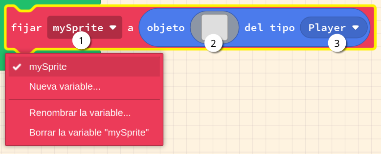

# Sprites

Els jocs expliquen una història, i aquestes històries requereixen personatges. En Arcade, aquests personatges es representen generalment utilitzant sprites. En aquesta activitat adquirirem les habilitats necessàries per crear, provar i desar sprites utilitzant l'entorn de desenvolupament MakeCode. Construirem sprites únics utilitzant el menú de sprites i l'editor d'imatges integrat.

En aquesta activitat veurem com:

- Usar blocs
- Sprites i imatges
- Utilitzar l'editor d'imatges
- Píxels i colors de píxels
- Codi de colors a l'editor d'imatges i blocs

---

## Concepte: Definir el valor d'una variable Sprite en l'editor d'imatges

<!--<iframe width="560" height="315" src="https://www.youtube.com/embed/gCtzHzg_BZM?si=hGVOmJkc8YpMckI3&amp;start=30" title="YouTube video player" frameborder="0" allow="accelerometer; autoplay; clipboard-write; encrypted-media; gyroscope; picture-in-picture; web-share" referrerpolicy="strict-origin-when-cross-origin" allowfullscreen></iframe>-->

Els blocs necessaris per crear sprites es troben al menú _Objetos_. El bloc set mySprite to és el primer bloc d'aquesta categoria que discutirem. L'exemple següent mostra la creació d'un sprite amb una imatge en blanc.

> **1**:  Aquí es defineix el nom de la variable Sprite. En aquest cas, el nom és mySprite.
> 
> **2**:  Aquest bloc crea un sprite amb una imatge en blanc. Si fem click a la icona de la imatge, s'obrirà l'editor d'imatges.
> 
> **3**: Podem seleccionar el tipus d'sprite que volem crear. En aquest cas, seleccionem el tipus `Player`.

---

### Tasca #1: Crea el teu propi sprite

1. Crea un nou projecte a Arcade.
2. Afegeix un nou sprite al teu projecte.
3. El tamany predefinit de l'sprite és de 16x16 píxels. Defineix el tamany de l'sprite a 32x32 píxels, modificant els valors **baix a l'esquerra** de l'editor d'imatges.
4. Dibuixa un sprite propi utilitzant l'editor d'imatges. Pots utilitzar la paleta de colors per seleccionar el color dels píxels.

---

### Tasca #2: Crea un sprite amb "nombres arcoiris"  

1. Crea un Sprite amb unes dimensions de 32x32 píxels.
2. Cadascún dels colors de la paleta de l'esquerra té un codi numéric. Revisa els codis i pinta un `0` amb el color `0` un `1` amb el color `1` i així successivament fins arribar al color `15`.
3. En la pantalla de joc, fes click en el botó "JavaScript" per veure el codi del joc. Que creus que fa el codi?

{: .nota }
> **Color de fons:**
> Per canviar el color de fons de l'sprite, pots utilitzar el bloc _fijar color de fondo a_, del menú _Escena_.

---

## Avaluació

Fes un document amb les respostes a les següents preguntes:

- Fes una taula amb tres columnes amb les següents dades:
  - Index del color (0-15)
  - Nom del color (aproximat; per exemple, vermell, blau, verd, etc.)
  - Representació del color en JavaScript    
- Que creus que està passant amb el color 0 en JavaScript?
- Perqué solomant podem veure 14 colors al mateix temps si la paleta de colors té 16 colors?

**Puja el document a l'aula virtual (tasca 1.1.3).**
