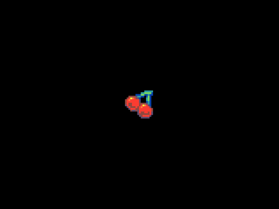

# Coordenades

Els _sprites_ es poden col·locar en diferents ubicacions de la pantalla. Això es fa establint les seves posicions x i y.

Per practicar amb les coordenades anem a situar imatges en punts concrets de la pantalla.

## Concepte: Coordenades

Les coordenades són els valors que indiquen la posició d'un objecte en la pantalla. Aquestes coordenades es mesuren en píxels.

Una posició x de 0 col·locarà l'_sprite_ al costat esquerre de la pantalla - això es pot pensar com a "0 píxels des de l'esquerra".

Una posició y de 0 col·locarà l'_sprite_ a la part superior de la pantalla.

En aquesta activitat veurem com situar un _sprite_ en una posició concreta de la pantalla.

---
### Pasos a seguir

1. Crea un nou projecte a Arcade.
2. Agrega un nou _sprite_ al teu projecte.
3. Utilitza l'opció `renombrar variable` per canviar el nom de l'_sprite_ a `cereza`.
4. Clica per fer que l'_sprite_ siga el d'una cirera. Pots dibuixar la cirera o utilitzar una imatge de la llibreria.
5. Utilitza el bloc `fijar cereza  a` per situar la `x` de l'_sprite_ a 25 i la y la deixarem a 0.
   - Podem veure com la cirera està dalt i a l'esquerra de la pantalla.
6. Situa ara la `y` a 45. On es troba ara la cirera?
7. Crea ara un altre _sprite_, anomeneu-lo `pizza` i situem-lo a la posició `x` 120 i `y` 80.

---

## Avaluació

- Agrega un tercer _sprite_ al teu projecte i situa'l a la posició `x` de la cirera i `y` de la pizza.
- Agrega un quart _sprite_ al teu projecte i situa'l a la posició `x` de la pizza i `y` de la cirera.
- Agrega un cinquè _sprite_ al teu projecte i situa'l al centre de la pantalla. Quina és la posició del centre de la pantalla?

Fes un document amb la captura de pantalla del resultat final i indica les coordenades de cada _sprite_.

**Puja el document a l'aula virtual (tasca 1.1.4).**
