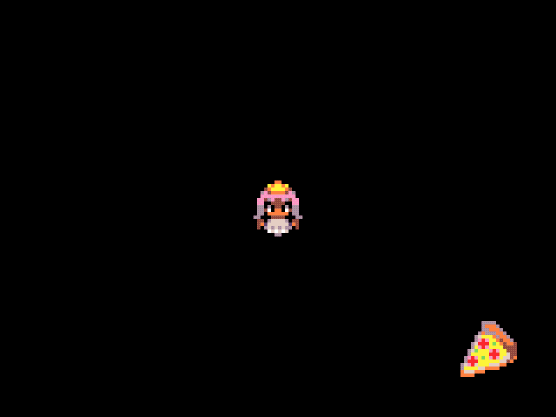

# Col·lisions i aleatorietat

## Concepte: Col·lisions

Les col·lisions es donen quan dos objectes es troben en el mateix lloc al mateix temps. En els jocs, les col·lisions poden ser útils per a moltes coses, com ara:

- Detectar quan un jugador ha recollit un objecte
- Detectar quan un jugador ha tocat un enemic
- Detectar quan un projectil ha tocat un enemic
- Detectar quan qualsevol cosa ha sortit de la pantalla

En aquesta activitat, utilitzarem el bloc `quan l'sprite es superposa a un altre sprite` per detectar col·lisions.

---

### Pasos a seguir

1. Crea un nou projecte a Arcade.
2. Agrega un nou sprite al teu projecte. Anomena'l `princesa`.
3. Dibuixa la princesa o utilitza una imatge de la llibreria.
4. Fes que la princesa es mogui amb el controlador.
5. Agrega un altre sprite al teu projecte. Anomena'l `pizza`.
6. Dibuixa la pizza o utilitza una imatge de la llibreria.
7. Fes que la pizza estiga en la posició `x` 140 i `y` 100.
8. Canvia el `tipus` de la pizza de `Player` a `Food`.
9. Agrega un bloc `quan l'sprite es superposa a un altre sprite` per a la princesa i la pizza.
10. Assegura't que `sprite` sigui de tipus `Player` i `altre sprite` sigui de tipus `Food`.
11. Fes que quan la princesa es superposi a la pizza s'acabe el joc amb un missatge de `GAME OVER`.
    - Pots utilitzar el bloc `game over` (del menú juego) per a això.
12. Prova el joc i assegura't que el missatge de `YOU WIN!` apareix quan la princesa toca la pizza.

---

## Concepte: Aleatorietat

L'aleatorietat és quan les coses es produeixen sense un patró o ordre. En els jocs, l'aleatorietat pot ser útil per a moltes coses, com ara:

- Fer que els enemics es moguin de manera imprevisible
- Fer que els objectes apareguin en llocs diferents
- Fer que els objectes es comportin de manera diferent cada vegada

En aquesta activitat, utilitzarem el bloc `escoger al azar de` per a generar un número aleatori i els blocs `anchura de pantalla` i `altura de pantalla` per a situar la pizza en una posició aleatòria pero dins de la pantalla.

### Pasos a seguir

1. Fes que la `x` de la pizza siga un número aleatori entre 0 i l'`anchura de pantalla`.
   - 
2. Fes que la `y` de la pizza siga un número aleatori entre 0 i l'`altura de pantalla`.
   - 
3. Prova el joc i assegura't que la pizza apareix en una posició aleatòria cada vegada que comences el joc i que el missatge de `YOU WIN!` apareix quan la princesa toca la pizza.

### Avaluació

- Agrega un sprite de monstre al teu projecte, en una posició aleatòria de la pantalla, i fes que quan la princesa toque el monstre, el joc s'acabe amb un missatge de `GAME OVER`. 
- Fes un document amb les següents captures de pantalla:
  - La princesa tocant la pizza amb el missatge de `YOU WIN!`.
  - La princesa tocant el monstre amb el missatge de `GAME OVER`.
  - Dos captures de pantalla més amb la pizza i el monstre en posicions aleatòries.
- **Puja el document a l'aula virtual (tasca 1.1.6).** 