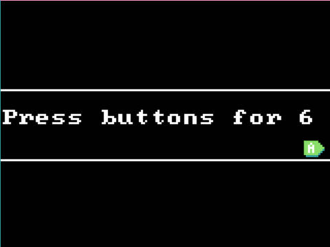

# Variables e informació

Les variables són com contenidors on es pot guardar informació. Aquesta informació pot ser un          número, una paraula, una llista d'elements, etc. En aquesta activitat, utilitzarem variables per a guardar la puntuació del joc.

Fins ara hem utilitzat les variables (encara que no ho hàgim dit de manera explícita) per a anomenejar els sprites (`princesa`, `pizza`, `monstre`, etc.) i per a guardar la posició dels sprites (`x` i `y`). Ara utilitzarem les variables per a guardar la puntuació del joc, mostrar-la a la pantalla i incrementar-la quan es donen certes condicions.

---

## Concepte: Utilitzem `puntuación` per comptar les pulsacions d'un botó

El primer exemple serà un de senzill - simplement comptar el nombre de vegades que es prem un botó i mantenir-lo com a puntuació. Aquesta puntuació es mostrarà a la pantalla.

### Tasca #1: Comptar les pulsacions d'un botó

1. Crea un nou projecte a Arcade.
2. Anomena el projecte `puntuacio`.
3. En el bloc `al iniciar`, utilitza el bloc `start countdown` amb el valor 10 per començar un compte enrere de 10 segons.
4. Utilitza un bloc `on A button pressed` per incrementar la puntuació en 1 cada vegada que es premi el botó `A`.

Com podeu veure, tant el temps restant com la puntuació es mostren per pantalla automàticament, sense necessitat de fer res més. També el joc acabarà quan el temps arribe a 0.

## Concepte: Vides

Les vides són una manera de donar als jugadors una segona oportunitat. Quan un jugador fa alguna cosa malament, com ara tocar un enemic, pot perdre una vida. Si el jugador es queda sense vides, el joc acaba.

En aquest joc utilitzarem les vides per marcar l'objectiu de polsar el botó `A` 15 vegades en menys de 2 segons.

### Tasca #2: Utilitzar les vides

1. Parteix del projecte anterior, definint unes vides inicials de 15 i una puntuació inicial de 0.
2. En el bloc `al iniciar`, utilitza el bloc `start countdown` amb el valor 2 per començar un compte enrere de 2 segons.
3. Utilitza un bloc `on A button pressed` per incrementar la puntuació en 2 cada vegada que es premi el botó `A` i decrementar les vides en 1.

## Avaluació

- Crea un document i penja captures de pantalla dels jocs i dels codis.
- Indica quines variables has utilitzat i per a què.
**- Penja el document a l'aula virtual (tasca 1.1.7).**