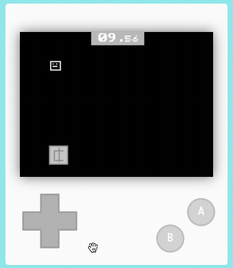

# Projecte primera part

En aquesta activitat hem de posar en pràctica tot el que hem après fins ara. 

Podeu triar el tipus de joc que vulgueu, però ha de complir els següents requisits:

1. Ha de tenir un personatge principal que es mogui amb les tecles de direcció.
2. Hem de tenir una puntuació que es mostri a la pantalla.
3. El joc ha d'acabar quan es compleixi una condició (per exemple, quan la puntuació arriba a 10 o, s'esgota el temps, es consumeixen totes les vides, etc.).
4. Ha d'haver-hi algun control de superposició entre dos objectes (per exemple, el personatge principal i un objecte que es mogui per la pantalla).
5. Algun dels sprites ha d'estar dissenyat per vosaltres.
6. Algún dels comportaments del joc ha de tindre un comportament aleatori.

## Avaluació

- Crea un document i agrega captures de pantalla del joc i del codi.
- Fes un resum de les característiques demanades que compleix el teu joc.
- **Penja el document a l'aula virtual (tasca 1.1.8).**

