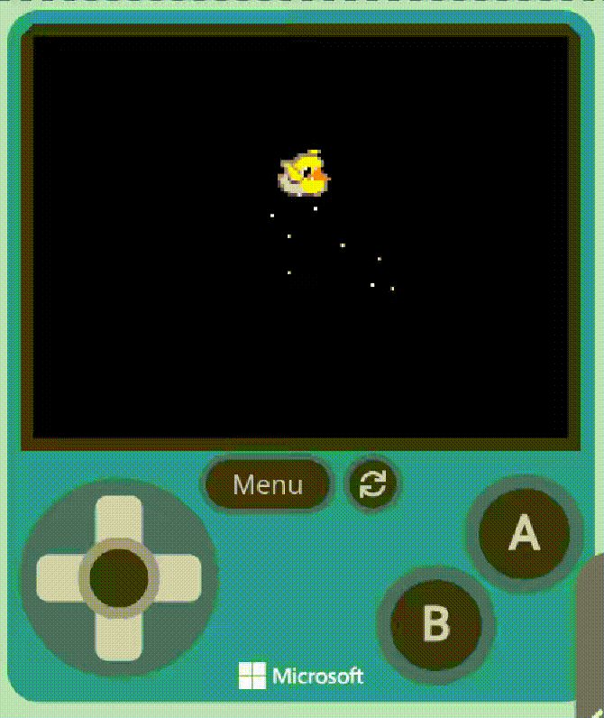

# Primer projecte: juguem a _pillar_!

---

## Què hem de fer

- **Practicarem les operacions amb sprites**.
- **Requisits**:
    - Dos sprites: un de tipus _Player_ i un altre de tipus _Projectile_.
    - El _Player_ es controla pel jugador i ha de fugir del _Projectile_, que el segueix i té un **efecte**.
    - Un l'heu de dissenyar vosaltres; l'altre, el podeu triar de la galeria.
    - Cadascú comença d'un cantó oposat.
    - Els dos han de **rebotar** en les parets.
    - Quan al _Player_ li toca el _Projectile_,escrirà algún **missatge**, mostrarà un **efecte** i desapareixerà.
    - **Avançat**: quan el _Player_ desapareix, es reinicien les posicions de forma aleatòria.

---

## Exemple

