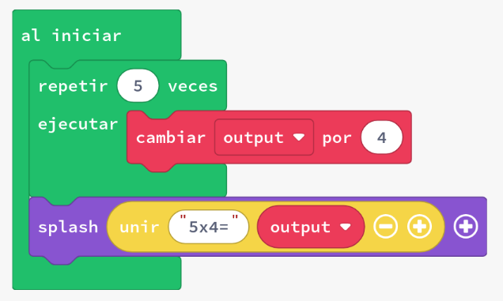
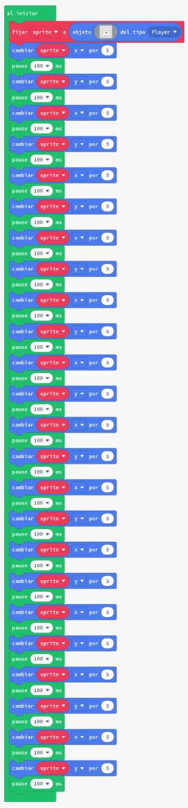
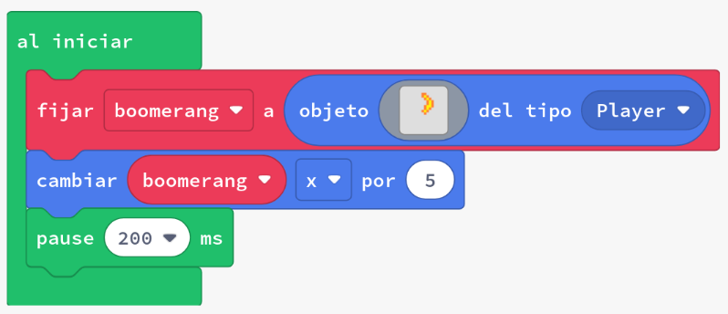

# Introducció als bucles

Quan escrivim codi, sovint volem repetir la mateixa acció. Utilitzant bucles, podem reduir la redundància en el nostre codi, és a dir, podem evitar escriure el mateix codi diverses vegades.

Un exemple de visualització d'un bucle és mirar la multiplicació d'enters com una addició repetida. L'addició repetida de l'enter 4 afegida cinc vegades:

```plaintext
    4 + 4 + 4 + 4 + 4 és igual a 4*5
```
Hem reduït la redundància en l'expressió

```plaintext
    4 + 4 + 4 + 4 + 4
```

utilitzant un operador diferent (multiplicació: *) per expressar la mateixa expressió global.

Podem utilitzar bucles per resoldre tasques d'una manera similar. El següent codi deixa la variable output amb el mateix resultat que les expressions anteriors.




En aquesta activitat els alumnes seran introduïts a:

- Moviment de sprites amb bucles
- Bucle `repeat`

## Concepte: Moviment de sprites amb bucles

Comencem per intentar resoldre una tasca petita: moure un fantasma des del centre de la pantalla cap a altres posicions. 

### Tasca 1: Moure el fantasma

1. Crea un nou projecte a Arcade.
2. Còpia el següent codi al projecte:

   - 
3. Observa com el fantasma es mou cap avall i a la dreta de la pantalla.
4. Fes que l'sprite es mogui cap amunt i a l'esquerra en lloc de cap avall i a la dreta - per fer-ho, canvia tots els moviments perquè siguin en la direcció contrària.
5. Canvia la pausa entre cada pas perquè sigui només de 50 ms, en lloc de 100 - hem decidit que volem que el fantasma sigui una mica més ràpid del que era.

## Concepte: Agrega un nou sprite amb un bucle

Fent la tasca anterior, probablement has notat que estaves fent la mateixa acció repetidament - moure't en una direcció, fer una pausa, moure't en una altra, fer una pausa, i després repetir-ho. En lloc de fer-ho inserint el mateix tros de codi diverses vegades, podem, utilitzant bucles, repetir aquest tros de codi més fàcilment.

### Tasca 2: Agrega un segon sprite amb un bucle

Volem ara afegir un segon fantasma que es mogui cap avall i a la dreta com en l'exemple anterior.

1. Afegeix un segon sprite
2. Fes que el segon sprite es mogui en la direcció contrària de l'sprite actual, amb cada pas immediatament després de l'sprite actual

{: .nota }
> El cos del bucle és el codi que està envoltat pel bucle. Hem d'afegir més cos al bucle. <br>
> Comença amb el codi de l'exemple. La solució no és molt diferent de l'exemple - només hem d'afegir el codi per al segon sprite al cos del mateix bucle.

### Tasca 3: Boomerang
    
1. Crea un nou projecte a Arcade.
2. Còpia el següent codi al projecte:

   - 
3. Agrega un sol bucle codi anterior perquè el boomerang vagi cap a la dreta 50 píxels durant dos segons.
4. **Repte:** Utilitza el bloc `girar imatge horitzontalment` dins dels bucles per fer que sembli que el boomerang està girant mentre es mou.

{: .nota }
> El moviment i els reflexos horitzontals es produiran molt ràpidament a menys que incloguis la pausa al bucle.

## Avaluació

- Crea un document i:
  - Descriu com un bloc de repetició fa que la programació sigui més fàcil reduint la repetició del codi. Utilitza un exemple.
  - Explica com és més fàcil (o més difícil) afegir un segon sprite al codi dins del bucle que hauria estat afegir-lo a la versió anterior (sense bucle)? Per què?
  - Has utilitzat més d'un bucle en qualsevol de les tasques anteriors? Per què podries voler tenir un bucle després de l'altre, en lloc de simplement combinar-los en un sol bucle? 

- **Penja el document a l'aula virtual (tasca 1.2.1).**
