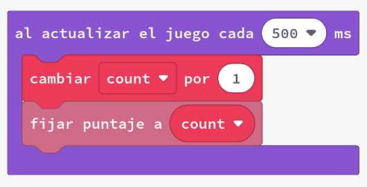
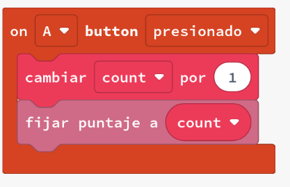
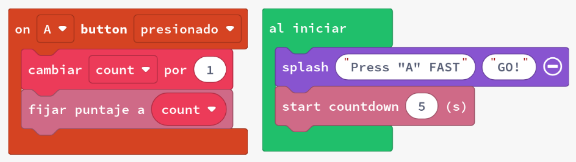
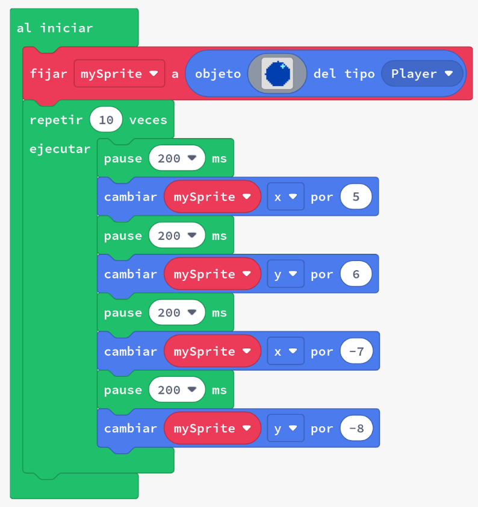
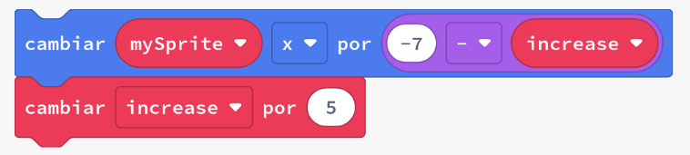
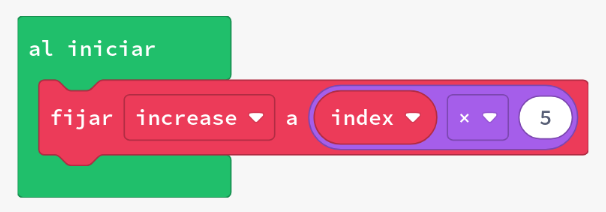

# Bucles d'increment

Els jocs sovint necessiten mantenir diverses variables per fer un seguiment de com ho està fent un jugador. Quan programem en blocs, hi ha moltes maneres en què el codi del joc necessita augmentar (o disminuir) un comptador.

Ens referim a augmentar un comptador com a incrementar-lo, i disminuir el comptador com a disminuir-lo. Actualitzarem la puntuació del nostre joc utilitzant el bloc de canvi.

En aquestes activitats veurem:

- bucles de repetició
- bucles per índex
- Variables amb `cambiar`
- `en actualització de joc cada`
- Gestió de la puntuació i comptes enrere

## Concepte: Incrementem una variable

Quan juguem a un joc, sovint volem mantenir un seguiment de la puntuació. Per fer-ho, necessitem una variable que pugui augmentar cada vegada que fem alguna cosa que ens doni punts. Per exemple, si el jugador aconsegueix un objectiu, la puntuació pot augmentar en 10 punts.

### Exemples: Incrementar una variable

1. Crea un nou projecte a Arcade.
2. Copia cadascún dels exemples següents i posa'ls en marxa.
    - **#1a** Actualitzant el valor cada 500ms:
      
    - **#1b** Actualitzant el valor quan es prem un botó:
      
    - **#1c** Actualitzant el valor en un comptador enrere:
      
3. Avalua com funciona cada exemple.
4. Modifica el valor de `por` en `cambiar count` i observa com canvia el comportament del joc.

### Tasca 1: Fem que el joc tinga un entrenador que ens anime

1. Comença amb el codi de l'exemple #1c
2. Afegeix un sprite que faça d'entrenador i motive el jugador
3. Utilitza `decir` per motivar al jugador, establint un temps d'exhibició curt (per exemple, 500 ms)
4. Fes que `diu` parpalleje, posant-lo en `en actualització de joc cada 1000 ms`
5. Repte: fes que l'sprite entrenador doni la puntuació actual a més d'un crit d'ànim ("Més ràpid!")

### Tasca 2: Fem que un sprite es moga en espiral

1. Crea un nou projecte a Arcade.
2. Copia el codi de l’exemple a l’editor de MakeCode Arcade i executa’l.
3. Observa quin moviment fa l'sprite. Volem que l'sprite es mogui en una espiral, ho està fent?
4. En una espiral, la longitud de cada costat augmenta. En l'exemple, els costats tenen 5, 6, 7 i 8 píxels de longitud. Per continuar l'espiral, necessitarem continuar fent que cada costat sigui més llarg que l'anterior. Fixa't que algunes de les longituds són valors negatius (aquests són per moure cap amunt o cap a l'esquerra).
    - En altres paraules: començant petit en un patró quadrat, i movent-se cada vegada més lluny a mesura que el procés d'iteració continua. Actualment, l'sprite es desplaça cap amunt i a l'esquerra. Necessitem augmentar la distància que l'sprite viatja en un costat per a cada iteració perquè es mogui més lluny per cada costat.
5. Agrega una variable anomenada `increment` i utilitza el bloc `cambiar` per incrementar `increment` en 5 al final del bucle.
6. Utilitza expressions matemàtiques com + i - per utilitzar la variable `increment` per augmentar la distància que es mou l'sprite en cada pas.

{: .nota }
> El punt 6 pot ser semblant a 

El codi anterior farà que la posició X de `mySprite` es mogui més lluny en 5 en cada iteració, ja que `increment` es fa 5 més gran cada vegada en el bucle. En l'exemple petit de codi anterior restem `increment` de -7 (com en -7 - increment). El resultat s'utilitza per actualitzar la coordenada x de l'sprite.

- **Primera iteració:** Canvi de la coordenada X de `mySprite` = -7
- **Segona iteració:** Canvi de la coordenada X de `mySprite` = -7 - 5 = -12
- **Tercera iteració:** Canvi de la coordenada X de `mySprite` = -7 - 10 = -17

En la següent tasca actualitzarem tots els costats de l'espiral.

### Exemple 2: Bucle for (per índex)

El bucle for (per índex) és un altre bucle comú. Aquest bucle té una variable de comptador incorporada que té el nom predeterminat `index` en blocs. El valor de `index` s'incrementa entre els valors introduïts en el bucle for. Podem utilitzar la variable `index` dins del cos del bucle for.

El bucle for (per índex) del 0 al 4 es comporta de manera similar al bucle de repetició, però dóna accés a una variable dins del bucle anomenada `index`. En cada iteració, aquest valor s'actualitzarà.

- En la primera iteració, l'índex serà 0
- En la segona iteració, l'índex serà 1
- I així successivament, fins que l'índex arribi a la iteració final - amb el valor predeterminat de 4

### Tasca 3: Moviment en espiral amb un bucle for

Aquest bucle proporcionarà la variable `index` per a ús similar a la variable `increment` de la tasca #2. Necessitem netejar el codi de la tasca #2 canviant a un bloc for.

1. Afegeix un bucle for a la solució de la tasca #2. Canvia el valor final de l'índex del bloc de 0 a 4 a 0 a 10. El teu codi ara hauria de comportar-se com ho feia abans de fer qualsevol modificació.
2. Canvia com definim la variable `increment`. Ja no incrementarem la variable, sinó que establirem el valor de `increment` a `index` multiplicat per 5 dins del bloc for de 0 a 10.
  - Exemple: 
    

## Avaluació

Crea un document i respon a les següents qüestions:

- Què és un bucle for (per índex)? Com és diferent d'un bucle de repetició?
- Com pots utilitzar una variable dins d'un bucle for (per índex) per fer que el teu codi sigui més flexible?
- En qualsevol de les tasques anteriors, per què podries voler utilitzar un bucle for (per índex) en lloc d'un bucle de repetició?

**Penja el document a l'aula virtual (tasca 1.2.2).**
