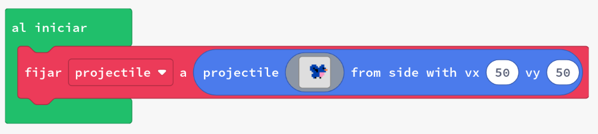
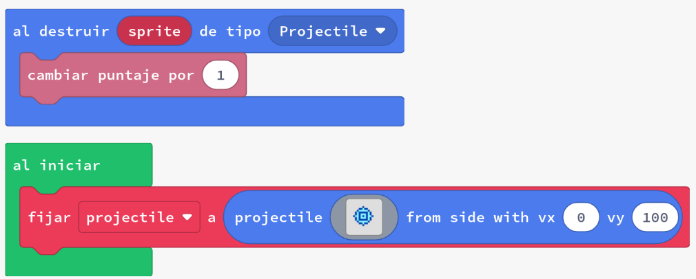
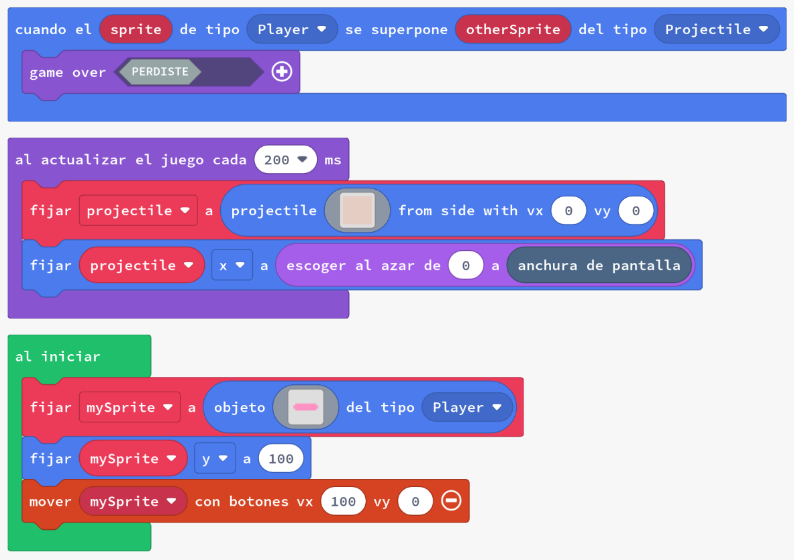

# Projectils

Els projectils són sprites normals que es destrueixen quan surten de la pantalla visible. Els blocs de sprites de projectils també exposen les propietats de velocitat (`vx` i `vy`) quan es creen.

Depenent del joc, un projectil pot ser perillós, amigable o fins i tot només una decoració que flota per la pantalla.

Normalment, utilitzem projectils perquè volem moviment per a meteors, feixos làser, cotxes o el que decidim que necessitem en els nostres jocs. En molts jocs, es creen un gran nombre de projectils, de manera que la capacitat de ser destruïts automàticament quan surten de la pantalla sovint serà molt útil per assegurar-nos que els nostres jocs funcionen eficientment.

En aquesta activitat, utilitzarem:

- Projectils desde els costats
- `al actualitzar el juego cada x ms`
- `escoger aleatorio`
- Bucle `para` 

## Concepte: Pardals voladors!

Podem utilitzar projectils per crear sprites que es moguin per la pantalla. Comencem fent un simple pardal projectil.

### Exemple #1: Pardal volador

1. Crea un nou projecte a Arcade.
2. Copia el codi de l'exemple a l'editor de MakeCode Arcade i executa'l.
3. Detecta quina part del codi fa que el pardal es mogui per la pantalla, en compte de quedar-se quiet.

Pot semblar sorprenent que només hi hagi un bloc dins de l'`al iniciar` per crear un projectil. Els projectils són una manera fàcil de crear sprites temporals amb moviment.

En la següent versió millorada agreguem un esdeveniment que s'activa quan el projectil és destruït - hauries de veure que quan el sprite surt de la pantalla, en realitat es destrueix automàticament!

{: .nota }
> Per defecte, el tipus d'un projectil és `Projectile`; això es pot canviar utilitzant el bloc `establir el tipus de mySprite a Jugador`.

La propietat `auto destroy` està disponible per a tots els sprites utilitzant el bloc `establir el sprite auto destroy a` però els projectils ja tenen aquesta propietat activada automàticament.

### Tasca #1: Fes que una pilota caigui

... i que una altra pilota puje cap amunt!

1. Crea un nou projecte a Arcade.
2. Copia el codi de l'exemple a l'editor de MakeCode Arcade i executa'l.
3. Modifica el codi perquè la pilota caiga per la pantalla a una velocitat de 50 en lloc de 100
4. Crea un segon projectil que vagi cap amunt per la pantalla a una velocitat de 50 (moguent-se en la direcció contrària a la pilota)
5. **Repte**: estableix la posició dels projectils perquè es moguin pel centre de la pantalla en lloc de per la vora
6. **Repte**: quan els dos projectils es superposen, fes que es diguin hola l'un a l'altre

## Concepte: Projectils creats per un bucle

Els jocs sovint creen molts projectils, un darrere l'altre. Podem crear múltiples projectils del mateix tipus dins del cos d'un esdeveniment `al actualitzar el juego cada`.

### Tasca #2: Crear projectils en bucle

1. Crea un nou projecte a Arcade.
2. Copia el codi de l'exemple a l'editor de MakeCode Arcade i executa'l.
3. Observa com els projectils es creen en una posició aleatòria sense velocitat.
4. Cada vegada que es crea un projectil, afegeix un punt a la puntuació utilitzant el bloc `cambiar puntaje por`
5. Fes que els projectils caiguin per la pantalla a una velocitat de 50
6. **Repte**: fes que els projectils es moguin en una velocitat aleatòria entre 40 i 60.

## Avaluació

Crea un document i respon a les següents qüestions:

- Quan utilitzaries un projectil en el teu joc? Per què?
- Haguessis pogut fer la tasca #1 sense utilitzar projectils? Descriu com ho hauries fet.
- I la tasca #2? Sabries crear un joc amb peces que cauen sense utilitzar projectils? Com ho faries?

**Penja el document a l'aula virtual (tasca 1.2.3).**
