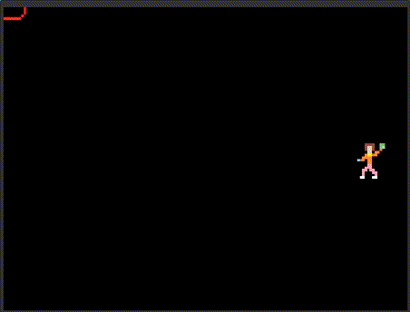
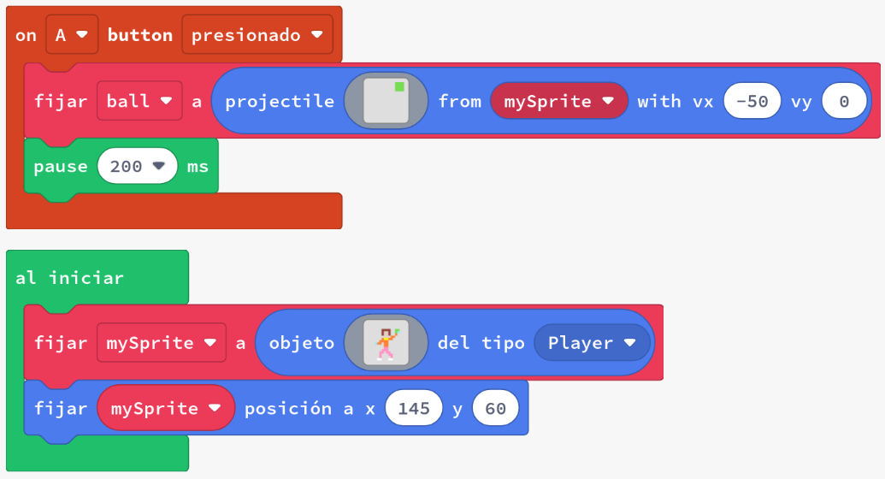
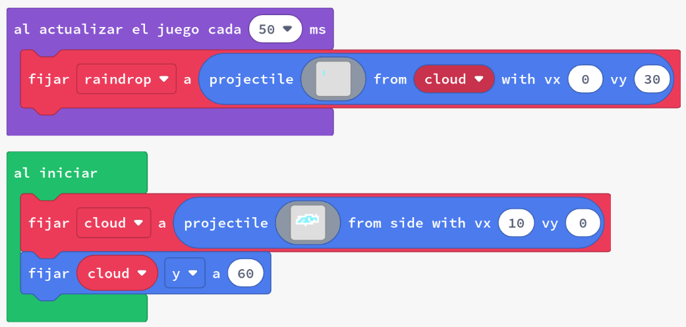

# _Sprites_ que creen projectils

Una altra opció per als projectils és establir un _sprite_ perquè en sigui l'origen. Això és particularment útil per crear efectes especials.

En aquesta activitat, els estudiants utilitzaran:

- `projectile from mySprite`
- `al destruir sprite`
- `escoger al azar`
- `ghost on`

## Concepte: Projectils creats per un _sprite_

Hi ha molts jocs que tenen _sprites_ que envien projectils. Podem establir projectils perquè surtin d'un _sprites_ per deixar caure monedes, crear obstacles, xutar una pilota o enviar un feix làser per destruir un asteroide utilitzant `projectile from mySprite`.

### Tasca #1: Llançar una pilota a un objectiu

1. Crea un nou projecte a Arcade.
2. Copia el codi de l'exemple a l'editor de MakeCode Arcade i executa'l.
3. Modifica el codi per fer un _sprite_ objectiu a l'altre costat de la pantalla del _sprite_ del jugador
4. Afegeix un temporitzador de compte enrere
5. Utilitza un bloc de codi `cuando el sprite se superpone` per agregar un punt i destruir la pilota quan la pilota toqui l'objectiu.
6. **Desafiament**: converteix l'objectiu en projectils que es moguin cap avall per la pantalla i afegeix moviment vertical al _sprite_ del jugador.

### Tasca #2: Un dia de pluja

1. Crea un nou projecte a Arcade.
2. Copia el codi de l'exemple a l'editor de MakeCode Arcade i executa'l.
3. Observa com es mou el núvol i com cauen les gotes de pluja des del núvol. És el resultat que esperaves?
4. Modifica el codi per fer que les gotes de pluja caiguin, en la vertical, de la part inferior del núvol i en l'horitzontal repartides aleatòriament per l'amplada del núvol.
5. El resultat ha de ser semblant al següent:
   
   
6. Fes que se sume un punt quan una gota toca el terra (aprofitant el bloc `al destruir sprite`).
7. Fes que s'acabe el joc quan el núvol surt de la pantalla.

### Tasca #3: Projectils cap amunt

1. Crea un nou projecte a Arcade.
2. Crea un personatge que pugui moure's horitzontalment per la pantalla, per la part inferior.
3. Fes que cada 100 ms creï un projectil cap amunt, que es mogui automàticament a 100 píxels per segon.

## Avaluació

Crea un document i respon a les següents qüestions:

- Quan creus que és útil utilitzar un projectil creat per un _sprite_ en el teu joc? Per què?
- Quins són els avantatges de fer que un projectil sigui creat per un _sprite_ en compte d'aparèixer per un costat de la pantalla?
- Fes proves ficant i llevant el _flag_ _ghost_ dels projectils. Què passa quan el _flag_ _ghost_ està activat? Per què?

**Penja el document a l'aula virtual (tasca 1.2.4).**
