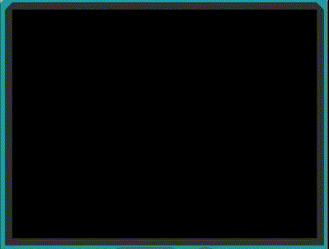

# Físiques dels sprites

Fins a aquest punt, hem passat per alt els detalls exactes de com funciona el moviment dels sprites. En aquesta activitat, els estudiants adquiriran una comprensió més gran de com la velocitat i l'acceleració d'un sprite afecten el seu comportament en un joc.

## Conceptes: Velocitat i acceleració

### Velocitat

La velocitat es defineix com la rapidesa en una direcció determinada. La velocitat és la distància en què canvia la posició d'un objecte, juntament amb la seva direcció, en algun període de temps.

En la vida real, pots pensar en la velocitat com si estiguessis en un tren o un cotxe; la velocitat en una autopista pot ser de 60 km per hora, però la velocitat seria de 60 km per hora cap al Nord. Això significa que al llarg d'una hora a aquesta velocitat, estaràs 60 km més al Nord del que estàs actualment.

A Arcade, la velocitat d'un sprite es mesura en **píxels per segon** i s'emmagatzema com a `vx` i `vy` d'un sprite. Això és perquè la pantalla del joc té dimensions, i per tant la distància en l'eix X o Y, es mesura en píxels.

La `vx` d'un sprite representa la velocitat del sprite en l'eix horitzontal i és la rapidesa amb què canvia el valor de `x` del sprite movent-se d'esquerra a dreta.

La `vy` d'un sprite representa la velocitat del sprite en l'eix vertical i és la rapidesa amb què canvia el valor de `y` del sprite movent-se de dalt a baix.

### Acceleració

L'accelaració representa la taxa de canvi en la velocitat. Pensem en això com en què un objecte s'està accelerant o desaccelerant en una direcció determinada. La gravetat és un bon exemple d'acceleració on els objectes que cauen augmenten en velocitat, caient més ràpidament i més ràpidament, en la direcció cap avall.

La relació entre l'acceleració i la velocitat és similar a la relació entre la velocitat i la posició. La velocitat és la taxa a la qual canvia la posició, i l'acceleració és la taxa a la qual canvia la velocitat.

En altres paraules, l'acceleració ens diu quan ràpidament canvia la velocitat. Premre l'accelerador fa que un cotxe vagi més ràpid fins que s'arriba a una nova velocitat. Això és un exemple d'acceleració. Premre els frens en el cotxe fa que es redueixi la velocitat, que és una acceleració negativa (desacceleració). Notem una força que ens empeny els nostres cossos quan hi ha acceleració.

A Arcade, l'acceleració d'un sprite es defineix en termes de **píxels per segon, per segon** (píxels/s/s).

### Exemple #1: Canvi de posició vs velocitat vs acceleració

1. Revisa el codi anterior i el funcionament dels sprites.
2. En particular, presta atenció a aquestes parts del codi:
   - `vx` i `vy` són les velocitats dels sprites.
   - `ax` i `ay` són les acceleracions dels sprites.
   - `x` i `y` són les posicions dels sprites.
   - Entens com les velocitats i les acceleracions afecten la posició dels sprites?

### Tasca #1: Globus d'aigua

1. Crea un nou projecte a Arcade.
2. Copia el codi de l'exemple a l'editor de MakeCode Arcade i executa'l.
3. Actualment, quan el globus col·lisiona amb el bloc, només crea una sola gota d'una esquitxada. Utilitza un bucle a l'esdeveniment de superposició entre els sprites de tipus `Balloon` i els sprites de tipus `Enemy` per crear 50 gotes de tipus `Splash`.
4. **Desafiament**: estableix l'acceleració per a cada esquitxada d'aigua emesa pel globus a 40 de manera que les esquitxades accelerin cap avall a la mateixa velocitat que ho va fer el globus.

{: .nota }
> En total, aquest bucle hauria d'incloure 4 blocs - la generació d'una xDirection i yDirection aleatòries, la creació del projectil i el bloc que estableix el _flag_ _ghost_ dels projectils perquè estigui activat.

### Tasca #2: Ocell volador

En aquesta tasca, faràs una versió bàsica d'un joc d'un ocell que vola esquivant obstacles. En aquest, l'ocell caurà a causa de la gravetat, i sempre que el jugador premi el botó A, l'ocell volarà cap al cel.

1. Crea un nou projecte a Arcade.
2. Crea un sprite d'un ocell a la pantalla.
3. Estableix una acceleració en la direcció `Y` perquè caigui per la pantalla a causa de la "gravetat".
4. Crea un esdeveniment `on A button presionado` i, dins d'aquest esdeveniment, utilitza el bloc `cambiar por` per canviar la velocitat de la pilota en la direcció Y, de manera que prémer el botó A faci que l'ocell puje i contraresti la "gravetat".
5. **Desafiament**: crea un esdeveniment `on game update every 2000 ms` que generi un projectil que es mogui horitzontalment per la pantalla. Estableix la posició Y del projectil a un lloc aleatori de la pantalla, utilitzant els blocs `escoger al azar` i `altura de la pantalla`. Fes que passi alguna cosa quan els projectils es superposen amb el sprite del jugador!

{: .nota }
> Prova diferents valors per a l'acceleració vertical que representa la gravetat `ay` com ara 25, 50, 100, 200.
> Quin és un valor raonablement desafiador per a l'acceleració de la gravetat per a l'ocell?

## Avaluació

Crea un document i respon a les següents qüestions:

- Què passa si la velocitat d'un sprite és negativa? Com es comporta el sprite?
- Què passa si l'acceleració d'un sprite és negativa? Com es comporta el sprite?
- Què passa si la velocitat d'un sprite és positiva i l'acceleració és negativa? Com es comporta el sprite? I si la velocitat és negativa i l'acceleració és positiva?

**Penja el document a l'aula virtual (tasca 1.2.5).**

