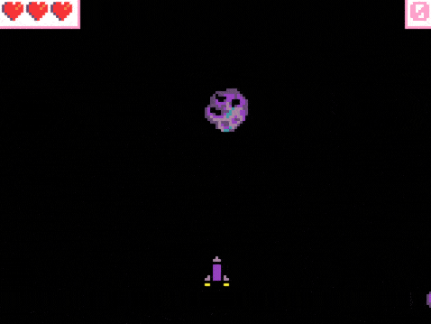

# Projecte bucles i projectils

En aquesta activitat hem de posar en pràctica tot el que hem après fins ara. 

Podeu triar el tipus de joc que vulgueu, però ha de complir els següents requisits:

- Ha de tenir un personatge principal que es mogui amb les tecles de direcció.
- S'han d'afegir projectils que es creïn des d'un _sprite_.
- També han d'existir projectils que apareguin de fora de la pantalla, creats per un bucle.
- S'ha de gestionar la col·lisió entre els projectils i el personatge principal.
- (Opcional) S'ha de gestionar la col·lisió entre projectils i altres projectils.
- Ha de tenir una puntuació que es mostri a la pantalla.

## Exemple

Si no tens clar com començar, et proposem fer un joc d'asteroides. 

Resum:
- En aquest joc, el personatge principal és una nau espacial que es mou amb els botons de direcció.
- Els asteroides apareixen de fora de la pantalla, una vegada cada segon, i es mouen cap avall.
- Quan un asteroide xoca amb la nau, perdem una vida i l'asteroide desapareix.
- La nau pot disparar projectils que es creen des de la nau, amb el botó A.
- Quan un projectil xoca amb un asteroide, s'incrementa la puntuació i l'asteroide desapareix.
- El joc acaba quan es consumeixen totes les vides.

## Avaluació

- Crea un document i agrega captures de pantalla del joc i del codi.
- Fes un resum de les característiques demanades que compleix el teu joc.
- **Penja el document a l'aula virtual (tasca 1.2.6).**

