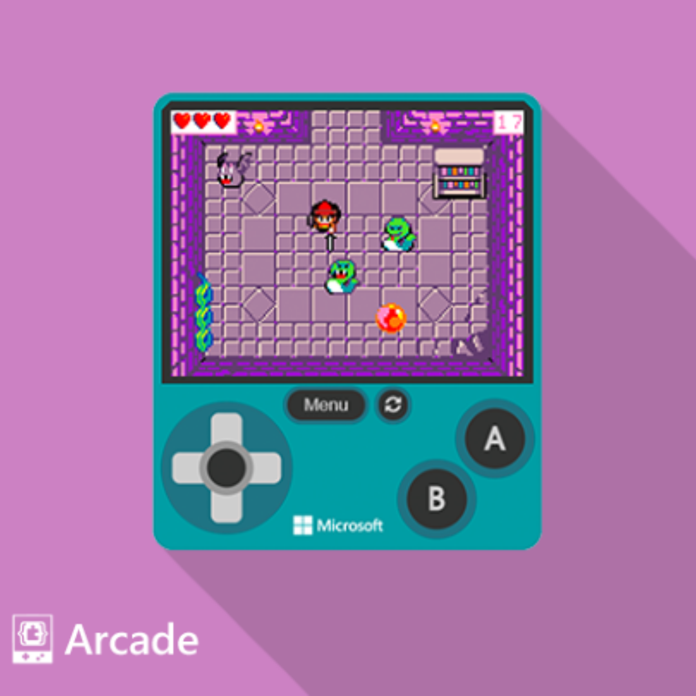

# Orientem-nos en MakeCode Arcade

En aquesta part veurem com començar a programar amb MakeCode Arcade.

Utiliza una forma visual de programar amb blocs, semblant a Scratch o App Inventor.

Per simplificar la programació, els blocs estan agrupats en categories: _Objetos_, _Mando_, _Escena_, _Información_, _Bucles_, _Variables_ i _Matemáticas_.

En aquesta activitat, els alumnes són introduïts a:

- Obrir un joc, controls de joc, i jugar un joc
- Crear un nou joc
- La diferència entre blocs i script
- "Els meus projectes"
- Compartir jocs guardant i creant un enllaç de joc

## Concepte: obrir un joc

<iframe width="560" height="315" src="https://www.youtube.com/embed/vDN2H4Cfbco?si=60FkTdeJgDOWHn2b" title="YouTube video player" frameborder="0" allow="accelerometer; autoplay; clipboard-write; encrypted-media; gyroscope; picture-in-picture; web-share" referrerpolicy="strict-origin-when-cross-origin" allowfullscreen></iframe>

## Tasca #1: Juguem a _Space Destroyer_

<iframe width="560" height="315" src="https://www.youtube.com/embed/_IyGtWYGB7g?si=2_MyZwQpUU94ipjF" title="YouTube video player" frameborder="0" allow="accelerometer; autoplay; clipboard-write; encrypted-media; gyroscope; picture-in-picture; web-share" referrerpolicy="strict-origin-when-cross-origin" allowfullscreen></iframe>

1. Fem clic a l'exemple de joc _Space Destroyer_ a la categoria _Blocks Games_.
2. Seleccionem _Abrir ejemplo_.
3. Premem les tecles de direcció **esquerra** i **dreta** per moure la nau espacial, i premem el botó **A** per disparar el làser.
4. Prestem atenció al que passa quan el làser col·lisiona amb un asteroid.

## Tasca #2: Creem un nou joc

1. Polsa el botó _Home_ a la part superior esquerra per tornar a la pàgina d'inici.
   
3. Polsa el botó _Nuevo proyecto_ i posa-li el nom _primer joc_.

4. Busca el bloc "fijar miSprite a" a la categoria _Objectes_, i arrossega'l dins del bloc _al iniciar_.

5. Fes que el nou sprite digui alguna cosa, arrossegant el bloc _miSprite decir_ i col·locant-lo després de _fijar miSprite a_.

6. A la part inferior de la pantalla, selecciona el botó _Guardar_ per desar el teu joc.

7. Descarrega el joc en format .uf2.

## Tasca #3: Compartim el joc

Per assegurar-nos que has guardat el teu projecte correctament, hem d'importar-lo de nou a Arcade!

1. Polsa el botó _Home_ a la part superior esquerra per tornar a la pàgina d'inici.
2. La secció _Els meus projectes_ hauria d'incloure el joc que has creat a la darrera tasca. A la seva dreta, hauria d'haver un botó etiquetat _Importar_ - prem aquest botó.
3. Selecciona _Importar fitxTo make sure you saved your project properly, we should import it back into Arcade!To make sure you saved your project properly, we should import it back into Arcade!
4. Selecciona el fitxer que vas desar a la tasca #2.
5. El teu codi hauria d'aparèixer a la finestra del navegador.
6. Alternativament, simplement pots arrossegar la imatge que vas descarregar a la pàgina d'inici i es carregarà automàticament.

## Tasca #4: Compartim el joc

Hi ha una altra manera comuna de fer seguiment dels nostres jocs: fent enllaços per accedir directament al codi.

1. Polsa el botó _Home_ a la part superior esquerra per tornar a la pàgina d'inici.
2. Selecciona el teu joc de la tasca #2 sota _Els meus projectes_.
3. Selecciona el botó _Compartir_ a la part superior esquerra, com es mostra a continuació. Verifica que vols publicar el codi, i fes un seguiment de l'URL que mostra: és un enllaç directe al teu codi!
4. Copia l'enllaç i envia'l a un company de classe perquè pugui veure el teu joc.
   

{: .nota }
> Desar i publicar jocs
> A més de compartir el teu joc, pots desar el teu joc com a projecte amb nom, descarregar-lo al maquinari i publicar el codi del teu joc en un repositori a GitHub.

### Avaluació

Fes un document amb les respostes a les següents preguntes:

- Que ha dit el bloc _miSprite decir_ quan l'has afegit al joc de la tasca #2?
- Compara i contrasta les dues maneres diferents que hem guardat el nostre joc; quins són els avantatges de cada elecció? Quina creus que utilitzaries si volguessis enviar un joc que has fet al teu amic per correu electrònic, i per què prendries aquesta decisió?
- Inclou la imatge creada a la tasca #2.
- Inclou l'enllaç creat a la tasca #4.

Puja el document a l'aula virtual.