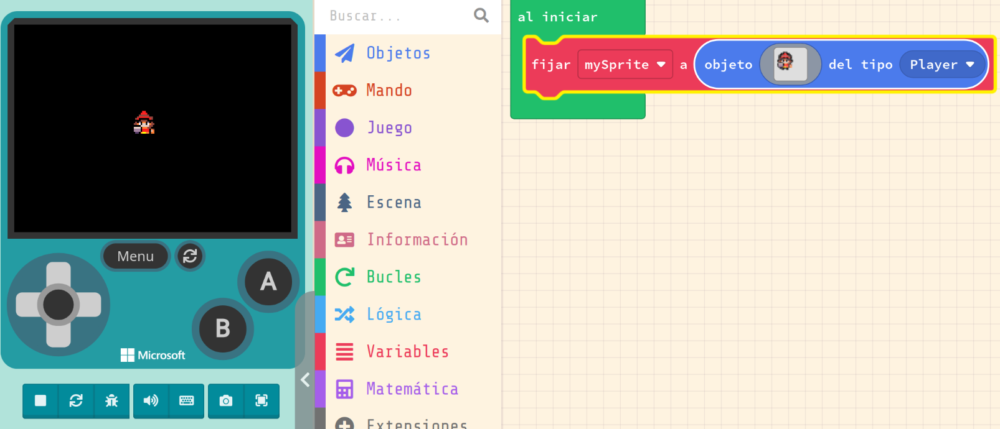
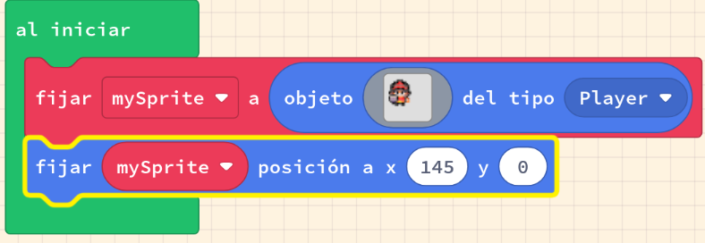
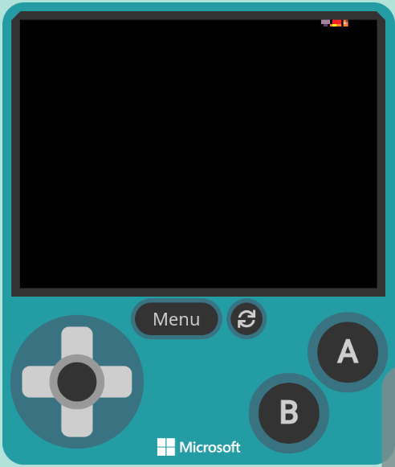

# Sprites

---

## Què és un Sprite?

- **Sprite**: és una imatge que es pot moure per la pantalla.
- **MakeCode Arcade** permet crear i controlar sprites.
- **Els sprites** poden ser personatges, enemics, objectes...
- **Els sprites** poden tenir diferents comportaments.
- Els nostres jocs estaran formats per **sprites**.

---

## Parts d'un bloc

- En makecode arcade els sprites s'utilitzen directament amb blocs. Les parts comuns d'un són:
    - **Variable**: el nom de l'element del joc que estem _setejant_ o _consultant_. Per exemple, el personatge principal.
    - **Sprite**: el dibuix que volem utilitzar.
    - **Tipus d'sprite**: la classificació de l'sprite. Per exemple, un personatge, un enemic, un objecte...

---

## Utilització

Podem crear sprites propis o utilitzar els que ja estan predefinits.

---

## Posicionat (I)

Comencem per agregar un sprite al nostre joc. Si no definim cap posicionament, el sprite apareixerà al centre de la pantalla.

---

## Posicionat (II)

Farem que al arrancar el joc el sprite es mogui a una posició concreta.

---

## Posicionat (III)

Vejam que passa.

---

## Moviment

- A l'igual que amb la posició, la velocitat oscil·la entre -100 i 100 píxels per segon.
- Un valor negatiu implica que l'objecte anirà cap enrere!
- L'eix x implica el moviment horitzontal, i l'eix y en vertical.
- Com podem fer que alguna cosa vagi només cap amunt? I cap enrere? I en diagonal?

---

## Altres propietats interessants

- Que farà cada una de les de dalt?
- Els efectes poden ser molt útils per a crear jocs més interessants.
- El bloc de baix que creus que fa?

---

## Resum. Hem aprés:

- A crear projectes, renombrar-los i compartir-los
- A crear un Sprite, assignar-lo a una variable
- A dibuixar el Sprite o utilitzar un de la galeria
- A modificar la posició i la velocitat d'un sprite
- A utilitzar totes les possibilitats de la categoria sprite!