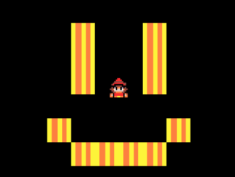
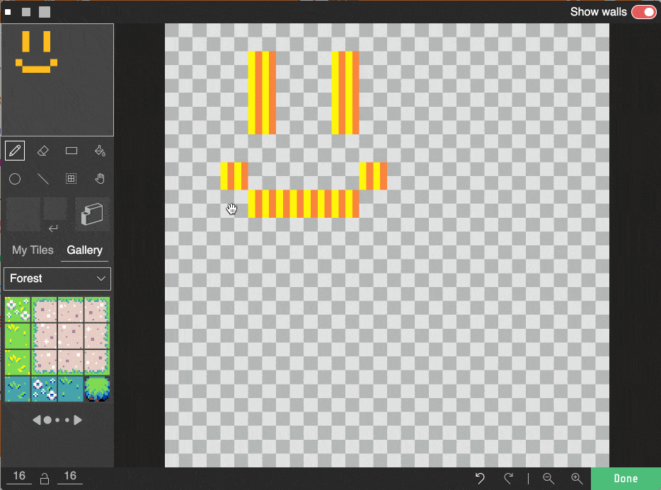

# Introducció als mapes de tesel·les

Els mapes i els nivells són la base de molts dels tipus més comuns de videojocs; permeten un lloc perquè la història del joc progressi i perquè el jugador pugui explorar.

A Arcade, els mapes de tesel·les proporcionen una manera fàcil de dissenyar mapes bidimensionals.

## Concepte: Mapa de tesel·les

Un mapa de tesel·les és una matriu bidimensional de tesel·les que es poden pintar a la pantalla. Cada tesel·la és una imatge petita que es pot utilitzar per a construir un mapa més gran.

En arcade el seu ús és molt senzill, només cal crear un mapa de tesel·les i pintar-lo a la pantalla. 

Vejam com usar-los en un exemple senzill.

---

### Pasos a seguir

1.- Crea un nou projecte a Arcade.

2.- Afegeix un nou mapa de tesel·les al teu projecte (Bloc `fija mapa de teselas a` del grup `Escena`).

3.- Fes clic a la icona de tesel·les per a obrir l'editor de tesel·les. Tria una tesel·la de la galeria (o crea la teva pròpia sota `My Tiles`), i dibuixa un petit mapa de tesel·les per al mapa de tesel·les.

5.- Executa el codi, i observa com el mapa de tesel·les es mostra com a fons. Cada píxel del dibuix a l'editor d'imatges es mostra com un quadrat de 16x16 a la pantalla.

6.- Fes que el teu personatge es mogui pel mapa de tesel·les amb els botons. Que passa quan el personatge toca una tesel·la? Per fer que el personatge no pugui travessar  una tesel·la haurem de marcar aquesta tesel·la com a paret.

7.- Obri l'editor de tesel·les, i fes clic a la icona de paret sobre la galeria. Utilitza-la per a dibuixar parets sobre les parts del teu mapa de tesel·les per les quals el jugador no hauria de poder moure's.

8.- Verifica que el teu personatge no pot travessar les parets.

9.- Què passa si el personatge surt de la pantalla? Utilitza el bloc `cámara sigue al objeto` per a fer que la càmera segueixi el personatge.

---

## Avaluació

Crea un document i:

- Agrega captures de pantalla del joc i del codi.
- Crea un mapa de tesel·les més gran i més complexe. Afegeix més tesel·les i més parets. Fes captures de pantalla del teu nou mapa.
- Que passa si el mapa de tesel·les és més gran que la pantalla?

**Puja el document a l'aula virtual (tasca 1.3.1).**