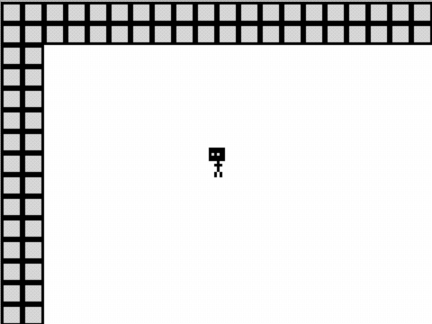

# Introducció als mapes de tessel·les

Els mapes i els nivells són la base de molts dels tipus més comuns de videojocs; permeten un lloc perquè la història del joc progressi i perquè el jugador pugui explorar.

A Arcade, els mapes de tessel·les proporcionen una manera fàcil de dissenyar mapes bidimensionals.

## Concepte: Mapa de tessel·les

Un mapa de tessel·les és una matriu bidimensional de tessel·les que es poden pintar a la pantalla. Cada tesel·la és una imatge petita que es pot utilitzar per a construir un mapa més gran.

En arcade el seu ús és molt senzill, només cal crear un mapa de tessel·les i pintar-lo a la pantalla. 

Vejam com usar-los en un exemple senzill.

---

### Passos a seguir

1. Crea un nou projecte a Arcade.

2. Afegeix un nou mapa de tessel·les al teu projecte (Bloc `fija mapa de teselas a` del grup `Escena`).

3. Fes clic a la icona de tessel·les per a obrir l'editor de tessel·les. Tria una tessel·la de la galeria (o crea la teva pròpia sota `My Tiles`), i dibuixa un petit mapa de tessel·les per al mapa de tessel·les.

5. Executa el codi, i observa com el mapa de tessel·les es mostra com a fons. Cada píxel del dibuix a l'editor d'imatges es mostra com un quadrat de 16x16 a la pantalla.

6. Fes que el teu personatge es mogui pel mapa de tessel·les amb els botons. Què passa quan el personatge toca una tessel·la? Per fer que el personatge no pugui travessar una tessel·la haurem de marcar aquesta tessel·la com a paret.

7. Obri l'editor de tessel·les, i fes clic a la icona de paret sobre la galeria. Utilitza-la per a dibuixar parets sobre les parts del teu mapa de tessel·les per les quals el jugador no hauria de poder moure's.

8. Verifica que el teu personatge no pot travessar les parets.

9. Què passa si el personatge surt de la pantalla? Utilitza el bloc `cámara sigue al objeto` per a fer que la càmera segueixi el personatge.

---

## Avaluació

Crea un document i:

- Agrega captures de pantalla del joc i del codi.
- Crea un mapa de tessel·les més gran i més complex. Afegeix més tessel·les i més parets. Fes captures de pantalla del teu nou mapa.
- Què passa si el mapa de tessel·les és més gran que la pantalla?

**Puja el document a l'aula virtual (tasca 1.3.1).**