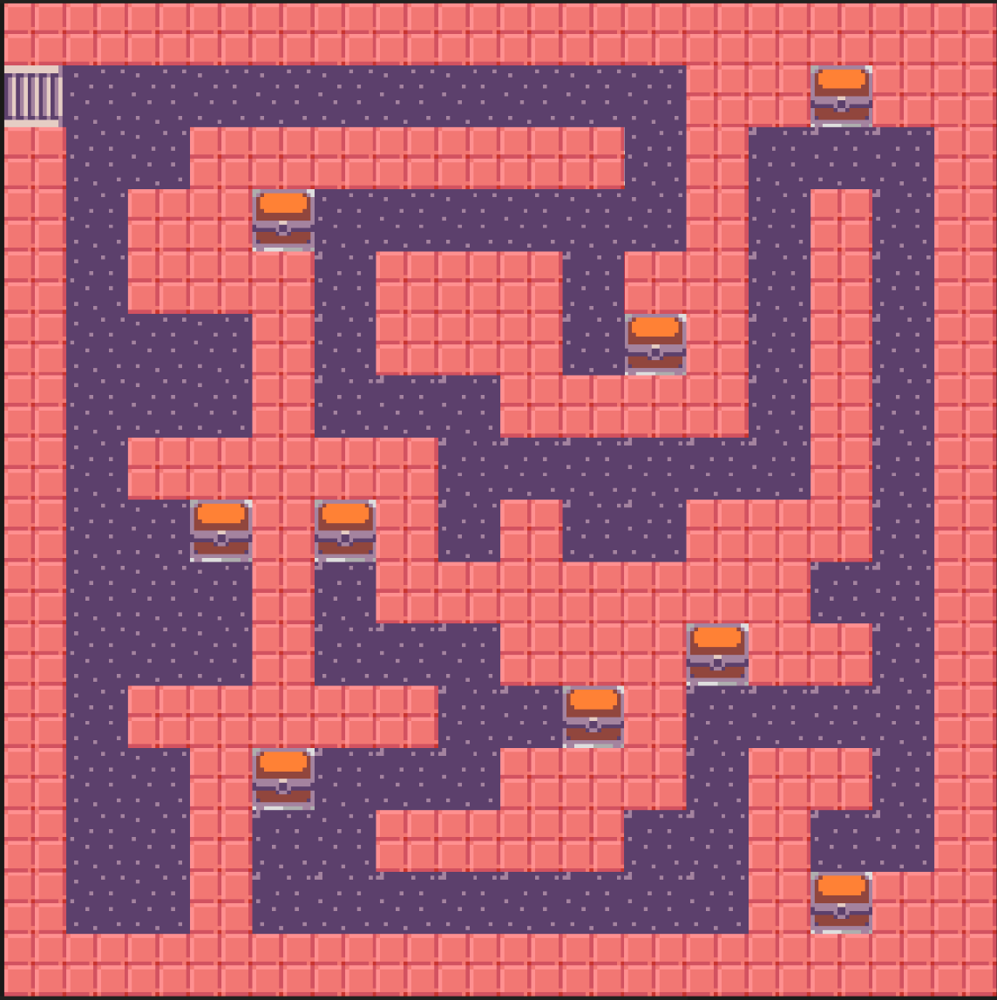

# Interaccions amb tessel·les

Fins ara hem vist com crear un mapa de tessel·les i com fer que el personatge es mogui per aquest mapa. Ara veurem com fer que el personatge pugui interactuar amb les tessel·les del mapa.

## Concepte: Interaccions amb tessel·les

Les interaccions amb tessel·les són quan els personatges del joc poden interactuar amb les tessel·les del mapa o el fet que l'usuari toqui una tessel·la ocasioni un esdeveniment. També utilitzarem tessel·les per substituir-les per _sprites_ que també poden interactuar amb el personatge.

Algunes de les interaccions més comunes són:

- Bloquejar el pas del personatge si toca una tessel·la de paret.
- Llevar vida al personatge si toca una tessel·la de lava.
- Passar a un altre nivell si toca una tessel·la de porta.
- Com ja hem dit, substituir les tessel·les per _sprites_ que poden interactuar amb el personatge.

En aquesta activitat, utilitzarem les tessel·les per a fer un petit joc de laberint. El personatge haurà de trobar el cofre del tresor per guanyar el joc.

---

### Passos a seguir

1. Crea un nou projecte a Arcade.

2. Fixa el fons a un mapa de tessel·les.

3. Crea un mapa de tessel·les buit de 16 x 16 tessel·les. Crea un laberint senzill amb les tessel·les de paret.

4. Agregar uns quants blocs amb cofres i un amb les escales per entrar al laberint.

5. Marca les tessel·les de paret com a parets.

6. El resultat final hauria de ser semblant a la següent imatge:

7. Crea un personatge i fes que es mogui pel laberint.

8. Fes que la càmera segueixi el personatge.

9. Utilitza el bloc `colocar mySprite encima de mapa teselas col x fila y` per situar el personatge a la posició inicial.

10. Creem un _sprite_ anomenat "Cofre" i fem que es posi substituint a una tessel·la de cofre, utilitzant el bloc `colocar mySprite encima de tipo_tesela aleatorio`.

11. Fes que el personatge comenci en 5 vides i que perdi una vida si toca una tessel·la de cofre, utilitzant el bloc `on sprite of kind mySprite overlaps tipo_tesela`. 

12. Per a evitar que perdi més d'una vida, quan el personatge toqui la tessel·la de cofre substitueix-la per una tessel·la de terra, utilitzant el bloc `fijar tipo_tesela en mapa teselas col x fila y`.

13. Fes que el personatge guanyi el joc si toca l'_sprite_ `Cofre`.

---

### Activitat

- Incorpora pomes al laberint que donen 1 vida al personatge si les toca. Fes que una d'aquelles estigui enverinada i li llevi una vida al personatge si la toca.
- Què passa si el personatge toca el cofre guanyador quedant-li tan sols una vida? Intenta solucionar-ho utilitzant el bloc `posicion de mapa de teselas de mySprite`.
- **Ampliació:** Fes que el personatge pugui disparar a les tessel·les de paret per a destruir-les. 

Fes un document amb la captura de pantalla del resultat final, del codi i les respostes a les preguntes.

Puja el document a l'aula virtual (tasca 1.3.2).