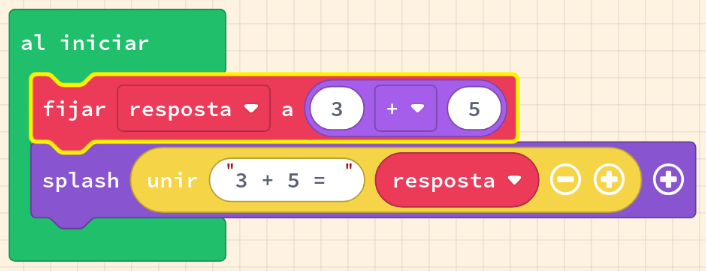
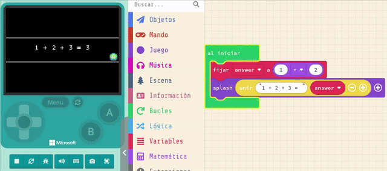
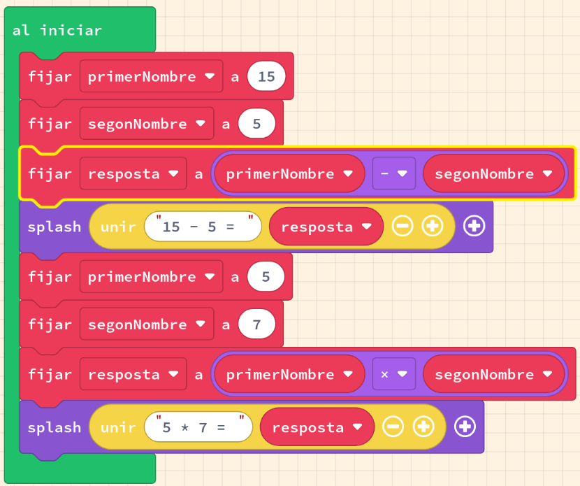

# Operacions amb variables

Una variable apunta a un contenidor que pot emmagatzemar dades. Hem utilitzat noms de variables per a _sprites_ (per exemple, **mySprite**). Les variables actuen com una adreça, i ens permeten emmagatzemar, recuperar i actualitzar dades. Per exemple, hem utilitzat mySprite per interactuar amb l'_sprite_ del nostre joc. La paraula "variable" també significa canvi. Podem actualitzar els valors als quals apunta la nostra variable, com ara actualitzar la variable mySprite perquè apunti a un _sprite_ completament diferent.

Les variables s'utilitzen àmpliament en la programació. Les variables permeten escriure codi de manera genèrica i faciliten la reutilització del nostre codi. Les equacions matemàtiques, com ara _X = 2Y_, proporcionen exemples familiars en l'ús de variables que s'apliquen al codi assignant valors coneguts a les variables per calcular valors de variables desconeguts.

Si sabem que _Y = 3_, podem calcular X a partir de la nostra equació. Més endavant, _Y_ pot tenir un valor diferent, com ara _Y = 7_. Podem reutilitzar l'equació, _X = 2Y_, per a tots dos valors de _Y_. D'aquesta manera, el valor de _X_ canviarà juntament amb el valor de _Y_.

{: .nota }
> **Definició de variable**: un contenidor utilitzat per emmagatzemar valors al vostre codi. 

En aquesta activitat veurem:

- Com expressar operacions numèriques amb operadors matemàtics (**+**, **-**, __*__, **/**)
- Emmagatzemar el resultat d'una equació en una variable
- Avaluar equacions utilitzant variables
- Modificar i crear equacions de variables
- Mostrar text amb _splash_ utilitzant `unir`
- Diferenciar entre els tipus de dades numèriques i de cadena

---

## Concepte: Utilitzar operadors matemàtics amb variables

### Tasca #1: Equació matemàtica en una variable

En aquest exemple veurem com emmagatzemar el resultat d'una equació en una variable. Aquesta variable es pot utilitzar per a mostrar el resultat en pantalla.

1. Crea un nou projecte a Arcade.
2. Copia el codi de l'exemple a l'editor de MakeCode Arcade i executa'l.
3. Experimenta utilitzant diferents nombres a la nostra equació (per exemple, 9 + 2)
4. **Repte**: fes equacions d'addició més llargues amb blocs de matemàtiques perquè el codi calculi la suma de 5 o més nombres. Si l'equació es fa massa llarga, llavors mostra-la utilitzant `mostrar texto largo`

{: .nota }
> Per a combinar diversos elements necessitarem afegir blocs matemàtics addicionals
> 
> 

---

## Concepte: Operacions matemàtiques básiques amb variables

Podem convertir equacions matemàtiques basades en variables, com _A = B + C_, en codi utilitzant les nostres variables de codi i operadors matemàtics.

### Operadors

Recordem: en matemàtiques, els operadors són els símbols que indiquen quina operació s'ha de realitzar. L'ordre d'operació predeterminat en matemàtiques és:

1. Multiplicació (__*__) i Divisió (**/**)
2. Suma (**+**) i Resta (**-**)

{: .nota }
> En programació se sol utilitzar __*__ per a la multiplicació i __/__ per a la divisió. Per a canviar l'ordre d'aquestes operacions, podeu utilitzar parèntesis **( )** al voltant de les expressions, igual que en matemàtiques.

### Tasca #2: Operacions matemàtiques amb variables

1. Crea un nou projecte a Arcade.
2. Copia el codi de l'exemple a l'editor de MakeCode Arcade i executa'l.
3. Agrega una variable `tercerNombre` amb un valor únic.
4. Crea una equació utilitzant l'operador d'addició (+) i l'operador de multiplicació (*).
5. Canvia l'operador d'addició per l'operador de multiplicació i a l'inrevés i executa el programa (normalment les respostes seran diferents).
6. Agrega una variable anomenada `quartNombre`.
7. Crea una equació utilitzant en tres operadors matemàtics diferents.
8. **Repte**: crea una equació amb quatre operadors matemàtics diferents.

{: .nota }
> Mira el codi en Python o JavaScript per a veure com es tradueixen les equacions matemàtiques a codi. Molt sovint, quan hi ha molts operadors, es més simple el codi que els blocs. Observa com els parèntesis s'utilitzen per a canviar l'ordre d'operació.

### Tasca #3: Conversió de dades

Crearem un conversor simple de temperatura de Celsius a Fahrenheit. Aquesta és una equació matemàtica senzilla que utilitza variables per a emmagatzemar els valors de temperatura.

1. Crea un nou projecte a Arcade.
2. Crea dues variables
   - `tempC` (temperatura Celsius)
   - `tempF` (temperatura Fahrenheit)
3. Assigna un valor a la variable `tempC` (per exemple, 22).
4. Crea una equació per a convertir la temperatura de Celsius a Fahrenheit. Utilitza la fórmula `tempF` = `tempC` × 9/5 + 32 i assigna el resultat a la variable `tempF`.
5. Mostra el resultat de la conversió de temperatura en pantalla.
6. **Repte**: crea un conversor de temperatura que converteixi de Fahrenheit a Celsius.
    - Utilitza la fórmula `tempC` = (`tempF` - 32) × 5/9.
    - compte en els parèntesis.

{: .nota }
> Si tens problemes per crear la fórmula pots intentar fer-ho amb el codi Python o JavaScript, on la sintaxi és més similar a les matemàtiques.

---

## Avaluació

Crea un document i respon a les següents qüestions:

- Què és una variable?
- En programació, quin és el valor resultant de `resposta` per a `resposta = 5 + 3 * 2`? Explica per què `resposta` no és 16.
- Descriu perquè és important utilitzar variables en programació.
- Quin seria el resultat de la conversió de temperatura de 24 graus Celsius a Fahrenheit? 

**Puja el document a l'aula virtual (tasca 1.4.1).**