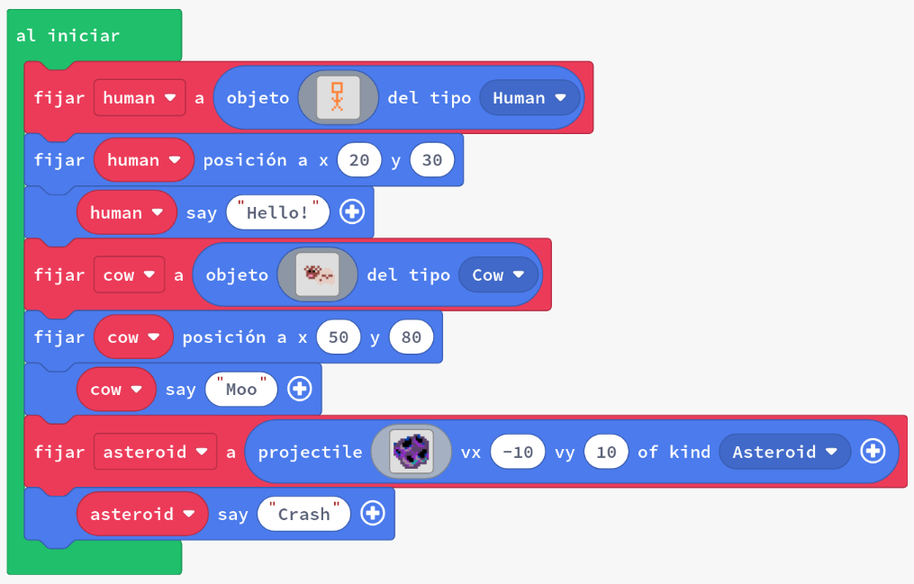
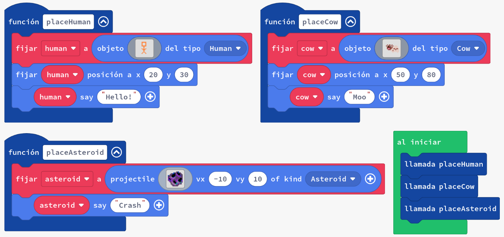
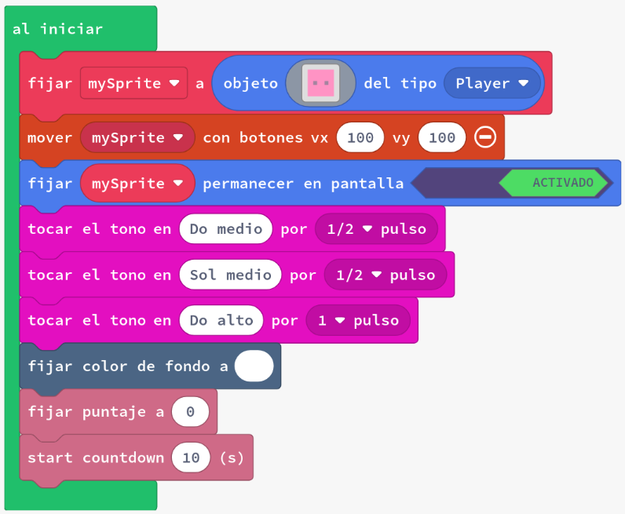
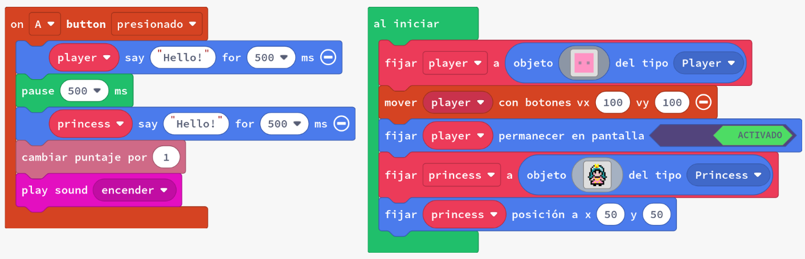

# Funcions

Les funcions són una manera de grups seccions de codi per ser executat de manera conjunta. S'utilitzen regularment en la programació per augmentar la llegibilitat del codi i permetre la reutilització d'accions comunes.

En Arcade les funcions es poden trobar a la secció `Avanzado`.

En aquesta activitat veurem com:

- Crear funcions senzilles en blocs
- Cridar funcions pel seu nom

---

## Concepte: Funcions per a la llegibilitat

Les funcions són una manera de grups seccions de codi per ser executat de manera conjunta. S'utilitzen regularment en la programació per augmentar la llegibilitat del codi i permetre la reutilització d'accions comunes.

### Exemple: Crear sprites amb funcions i sense funcions

Crea un projecte nou a Arcade i, per cadascun dels exemples següents copia el codi a l'editor de MakeCode Arcade i executa'l (els canvis són petits entre els exemples). Observa les diferències en el comportament del joc.

1. Sense funcions:

<div class="blocks-comparison" markdown="1">
<div class="comparison-col" markdown="1">
<div class="comparison-title">⚡ Bloc natiu (MakeCode)</div>

```blocks
let human = sprites.create(img`
    . . . . . . 5 . 5 . . . . . . .
    . . . . . f 5 5 5 f . . . . . .
    . . . . f 5 5 5 5 5 f . . . . .
    . . . . f d d d d d f . . . . .
    . . . . f d 1 f 1 d f . . . . .
    . . . . f d d d d d f . . . . .
    . . . . . f d d d f . . . . . .
    . . . . . . f f f . . . . . . .
    . . . . . 8 8 8 8 8 . . . . . .
    . . . . 8 8 8 8 8 8 8 . . . . .
    . . . . 8 8 8 8 8 8 8 . . . . .
    . . . . 8 8 8 8 8 8 8 . . . . .
    . . . . 8 8 8 8 8 8 8 . . . . .
    . . . . . 8 8 8 8 8 . . . . . .
    . . . . . d d . d d . . . . . .
    . . . . . d d . d d . . . . . .
`, SpriteKind.Player)
human.setPosition(20, 30)
human.sayText("Hello!")
let cow = sprites.create(img`
    . . . . . . . . . . . . . . . .
    . . . . . . . . . . . . . . . .
    . . . 1 1 . . . . . . 1 1 . . .
    . . . 1 f 1 1 1 1 1 1 f 1 . . .
    . . . 1 1 1 1 1 1 1 1 1 1 . . .
    . . 1 1 1 f 1 1 1 1 f 1 1 1 . .
    . . 1 1 1 1 1 1 1 1 1 1 1 1 . .
    . . 1 1 1 1 1 1 1 1 1 1 1 1 . .
    . . . 1 1 1 1 1 1 1 1 1 1 . . .
    . . . . 1 1 1 1 1 1 1 1 . . . .
    . . . . . . . . . . . . . . . .
`, SpriteKind.Player)
cow.setPosition(50, 80)
cow.sayText("Moo")
let asteroid = sprites.createProjectileFromSide(img`
    . . . . . c c c c c . . . . . .
    . . . c c f f f f f c c . . . .
    . . c f f f f f f f f f c . . .
    . c f f f f f f f f f f f c . .
    . c f f f f f f f f f f f c . .
    . c f f f f f f f f f f f c . .
    . . c f f f f f f f f f c . . .
    . . . c c f f f f f c c . . . .
    . . . . . c c c c c . . . . . .
`, -10, 10)
asteroid.sayText("Crash")
```

</div>
<div class="comparison-col" markdown="1">
<div class="comparison-title">📷 Captura original</div>



</div>
</div>

2. Amb funcions:

<div class="blocks-comparison" markdown="1">
<div class="comparison-col" markdown="1">
<div class="comparison-title">⚡ Bloc natiu (MakeCode)</div>

```blocks
function placeAsteroid() {
    let asteroid = sprites.createProjectileFromSide(img`
        . . . . . c c c c c . . . . . .
        . . . c c f f f f f c c . . . .
        . . c f f f f f f f f f c . . .
        . c f f f f f f f f f f f c . .
        . c f f f f f f f f f f f c . .
        . c f f f f f f f f f f f c . .
        . . c f f f f f f f f f c . . .
        . . . c c f f f f f c c . . . .
        . . . . . c c c c c . . . . . .
    `, -10, 10)
    asteroid.sayText("Crash")
}
function placeCow() {
    let cow = sprites.create(img`
        . . . . . . . . . . . . . . . .
        . . . . . . . . . . . . . . . .
        . . . 1 1 . . . . . . 1 1 . . .
        . . . 1 f 1 1 1 1 1 1 f 1 . . .
        . . . 1 1 1 1 1 1 1 1 1 1 . . .
        . . 1 1 1 f 1 1 1 1 f 1 1 1 . .
        . . 1 1 1 1 1 1 1 1 1 1 1 1 . .
        . . 1 1 1 1 1 1 1 1 1 1 1 1 . .
        . . . 1 1 1 1 1 1 1 1 1 1 . . .
        . . . . 1 1 1 1 1 1 1 1 . . . .
        . . . . . . . . . . . . . . . .
    `, SpriteKind.Player)
    cow.setPosition(50, 80)
    cow.sayText("Moo")
}
function placeHuman() {
    let human = sprites.create(img`
        . . . . . . 5 . 5 . . . . . . .
        . . . . . f 5 5 5 f . . . . . .
        . . . . f 5 5 5 5 5 f . . . . .
        . . . . f d d d d d f . . . . .
        . . . . f d 1 f 1 d f . . . . .
        . . . . f d d d d d f . . . . .
        . . . . . f d d d f . . . . . .
        . . . . . . f f f . . . . . . .
        . . . . . 8 8 8 8 8 . . . . . .
        . . . . 8 8 8 8 8 8 8 . . . . .
        . . . . 8 8 8 8 8 8 8 . . . . .
        . . . . 8 8 8 8 8 8 8 . . . . .
        . . . . 8 8 8 8 8 8 8 . . . . .
        . . . . . 8 8 8 8 8 . . . . . .
        . . . . . d d . d d . . . . . .
        . . . . . d d . d d . . . . . .
    `, SpriteKind.Player)
    human.setPosition(20, 30)
    human.sayText("Hello!")
}
placeHuman()
placeCow()
placeAsteroid()
```

</div>
<div class="comparison-col" markdown="1">
<div class="comparison-title">📷 Captura original</div>



</div>
</div>

Una forma de pensar en això és com un llibre: afegint noves funcions al nostre codi, podem fer que els blocs dins del bloc `al iniciar` se semblin a una taula de continguts del nostre codi, amb descripcions senzilles de les tasques que volíem realitzar.

Cada funció acaba sent un capítol del llibre amb més detalls sobre què s'està fent exactament. Si voleu tenir una idea de com serà el llibre, podeu llegir la taula de continguts, i si algunes parts us semblen interessants, podeu llegir-les anant a la ubicació especificada (o funció).

### Tasca #1a: Crear una funció

<div class="blocks-comparison" markdown="1">
<div class="comparison-col" markdown="1">
<div class="comparison-title">⚡ Bloc natiu (MakeCode)</div>

```blocks
let mySprite = sprites.create(img`
    . . . . . . . . . . . . . . . .
    . . . . . . . . . . . . . . . .
    . . . . . . . . . . . . . . . .
    . . . . . . . . . . . . . . . .
    . . . . . . . . . . . . . . . .
    . . . . . . 3 3 . . . . . . . .
    . . . . . . 3 3 . . . . . . . .
    . . . . . . . . . . . . . . . .
    . . . . . . . . . . . . . . . .
    . . . . . . . . . . . . . . . .
    . . . . . . . . . . . . . . . .
    . . . . . . . . . . . . . . . .
    . . . . . . . . . . . . . . . .
    . . . . . . . . . . . . . . . .
    . . . . . . . . . . . . . . . .
    . . . . . . . . . . . . . . . .
`, SpriteKind.Player)
controller.moveSprite(mySprite, 100, 100)
mySprite.setStayInScreen(true)
music.playTone(262, music.beat(BeatFraction.Half))
music.playTone(392, music.beat(BeatFraction.Half))
music.playTone(523, music.beat(BeatFraction.Whole))
scene.setBackgroundColor(1)
info.setScore(0)
info.startCountdown(10)
```

</div>
<div class="comparison-col" markdown="1">
<div class="comparison-title">📷 Captura original</div>



</div>
</div>

1. Crea un nou projecte a Arcade.
2. Copia el codi de l'exemple a l'editor de MakeCode Arcade i executa'l.
3. Crea 3 funcions diferents, amb noms que descriguin diferents seccions del codi.
   - Borra els blocs del bloc `al iniciar` i divideix-los en les tres funcions diferents. Cada funció ha de tenir 3 dels 9 blocs.
   - Utilitza el bloc `llamada función` 3 vegades al bloc `al iniciar` per a cridar cada nova funció.
4. Assegura't que el teu codi es comporta **exactament** igual que el codi de l'exemple.

{: .nota }

> Les 3 funcions haurien de cobrir la configuració inicial de l'_sprite_, la reproducció de la música i la visualització d'elements.
> Prova de reordenar les crides de funció al bloc `al iniciar` - passa alguna cosa, o passa en un ordre diferent?

### Tasca #1b: Funcions en events

Les funcions es poden utilitzar en tot el codi, no només en el bloc `al iniciar`.

En aquesta tasca, netejarem l'esdeveniment `al prémer el botó A` per fer-lo una mica més fàcil de llegir.

<div class="blocks-comparison" markdown="1">
<div class="comparison-col" markdown="1">
<div class="comparison-title">⚡ Bloc natiu (MakeCode)</div>

```blocks
let player: Sprite = null
let princess: Sprite = null
controller.A.onEvent(ControllerButtonEvent.Pressed, function () {
    player.sayText("Hello!", 500, false)
    pause(500)
    princess.sayText("Hello!", 500, false)
    info.changeScoreBy(1)
    music.powerUp.play()
})
player = sprites.create(img`
    . . . . . . . . . . . . . . . .
    . . . . . . . . . . . . . . . .
    . . . . . . . . . . . . . . . .
    . . . . . . . . . . . . . . . .
    . . . . . . . . . . . . . . . .
    . . . . . . 3 3 . . . . . . . .
    . . . . . . 3 3 . . . . . . . .
    . . . . . . . . . . . . . . . .
    . . . . . . . . . . . . . . . .
    . . . . . . . . . . . . . . . .
    . . . . . . . . . . . . . . . .
    . . . . . . . . . . . . . . . .
    . . . . . . . . . . . . . . . .
    . . . . . . . . . . . . . . . .
    . . . . . . . . . . . . . . . .
    . . . . . . . . . . . . . . . .
`, SpriteKind.Player)
controller.moveSprite(player, 100, 100)
player.setStayInScreen(true)
princess = sprites.create(img`
    . . . . . . 5 . 5 . . . . . . .
    . . . . . f 5 5 5 f . . . . . .
    . . . . f 5 5 5 5 5 f . . . . .
    . . . . f d d d d d f . . . . .
    . . . . f d 1 f 1 d f . . . . .
    . . . . f d d d d d f . . . . .
    . . . . . f d d d f . . . . . .
    . . . . . . f f f . . . . . . .
    . . . . . 8 8 8 8 8 . . . . . .
    . . . . 8 8 8 8 8 8 8 . . . . .
    . . . . 8 8 8 8 8 8 8 . . . . .
    . . . . 8 8 8 8 8 8 8 . . . . .
    . . . . 8 8 8 8 8 8 8 . . . . .
    . . . . . 8 8 8 8 8 . . . . . .
    . . . . . d d . d d . . . . . .
    . . . . . d d . d d . . . . . .
`, SpriteKind.create())
princess.setPosition(50, 50)
```

</div>
<div class="comparison-col" markdown="1">
<div class="comparison-title">📷 Captura original</div>



</div>
</div>

1. Crea un nou projecte a Arcade.
2. Copia el codi de l'exemple a l'editor de MakeCode Arcade i executa'l.
3. Crea 2 funcions noves, anomenades `conversa` i `punts`.
4. Mou els blocs de l'esdeveniment `al prémer el botó A` per a la conversa a la funció `conversa`, i els blocs per a sumar un punt i reproduir un so a la funció `punts`.
5. Utilitza el bloc `llamada función` 2 vegades a l'esdeveniment `al prémer el botó A` per a cridar les dues noves funcions.
6. **Repte**: Crea un esdeveniment `al solapar` que utilitzi
   - la funció `conversa`
   - una funció addicional (per exemple, `conversaJugador` o `moureJugador`)

---

## Avaluació

Crea un document i respon a les següents qüestions:

1. Què són les funcions i per què són importants en la programació?
2. Posar el codi en funcions separades sempre té sentit? Seria més clar si prenguéssim el codi de l'exemple **#2** i fèssim una funció que cridés les altres tres, de manera que el nostre bloc `al iniciar` només tingués un bloc dins?

**Puja el document a l'aula virtual (tasca 1.4.1).**
