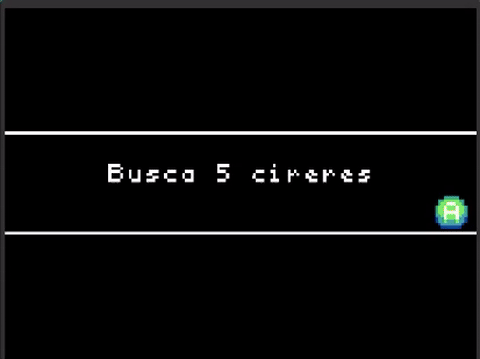
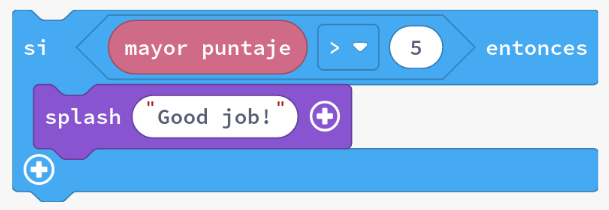
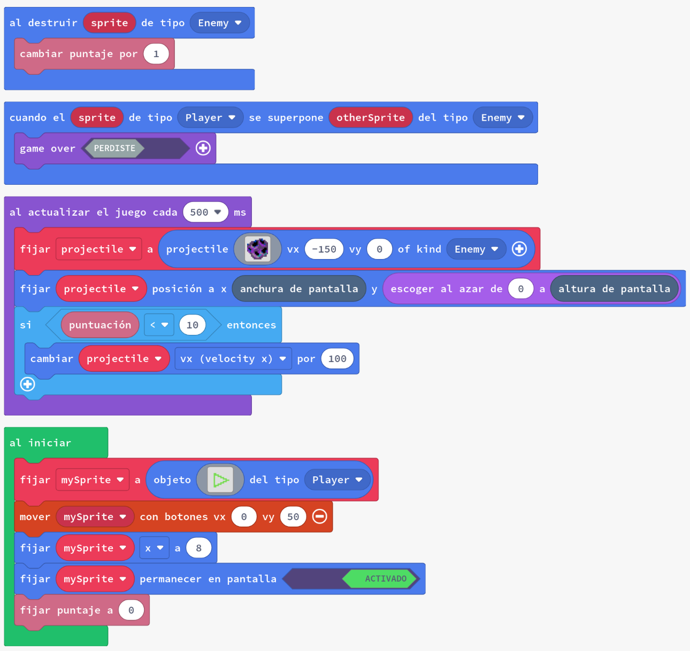
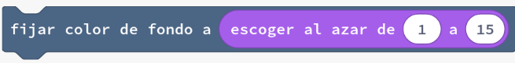

# Introducció a la lògica

La lògica en el desenvolupament de programari permet programes flexibles que responen adequadament a diferents condicions. En aquesta secció, identificarem com les comparacions es poden utilitzar dins del nostre codi.

- Com utilitzar l'estructura de control `si`
- Com comparar valors utilitzant operadors de comparació

---

## Concepte: Comparacions

En els nostres jocs sovint voldrem comparar valors i prendre una acció quan la declaració de comparació sigui certa.

{: .nota }
> **Exemple**: ¿És _potenciaLaser_ (8) més gran que _resistenciaEscutsEnemics_ (5)? Si és cert que la potència del làser és més gran que la resistència dels escuts enemics, llavors afegirem 1 a _numEnemicsDestruits_.

Per prendre decisions basades en el valor d'una variable, utilitzem l'estructura de control `si`.

Ja hem vist estructures de control semblants a `si` en el nostre codi. Per exemple, quan vam utilitzar `quan A premut` per a detectar si un botó estava premut. En aquest cas, el codi dins del bloc `quan A premut` només s'executava si el botó A estava premut.

`si` és una estructura de control més general que ens permet comparar valors i executar codi basat en aquesta comparació. A continuació, veurem com utilitzar `si` com alterar el flux del nostre programa basat en comparacions.

---

## Concepte: Estructura de control `si`

L'estructura de control `si` executa un test, i si el test es compleix, llavors executarà el codi que s'ha donat. Alguns exemples addicionals són:

- Si la puntuació és superior a 10, llavors donar temps de compte enrere addicional
- Si el jugador no té vides, llavors fi del joc

Aquestes són el que es coneixen com a comparacions perquè comparen el valor de dues coses.

Per utilitzar un bloc de declaració `si`, hem d'emplenar-lo amb una prova de comparació. Si la prova és certa, el codi del bloc s'executarà. A continuació, es mostra una comparació per veure si la puntuació més alta és superior a 5.

---

## Concepte: Operadors de comparació

Quan comparem nombres tenim dos nombres, en un ordre específic, i el que es coneix com a operador de comparació. Un operador de comparació ens permet especificar quin tipus de comparació estem fent. Alguns bàsics són:

- `>` (Més gran que): determina si el primer valor donat representa una quantitat més gran que el segon valor.
- `<` (Menys que): determina si el primer valor donat representa una quantitat més petita que el segon valor.
- `=` (Igual a): determina si els dos valors donats representen la mateixa quantitat.

### Exemple #1: Menys que

1. Crea un nou projecte a Arcade.
2. Copia el codi de l'exemple a l'editor de MakeCode Arcade i executa'l.
3. Juga al joc i observa com el codi utilitza la lògica `si` i una comparació de menys que per a modificar el joc.

Quan el joc crea un nou enemic, comprova si la puntuació del jugador és inferior a un valor determinat.

Si aquest és el cas, el jugador acaba de començar a jugar, de manera que el joc facilita les coses al jugador disminuint la velocitat en què els projectils són llançats al jugador. 

Busca aquesta part del codi i intenta canviar el valor de la comparació per veure com canvia el joc.

---

### Tasca #1a: Puntuació

1. Crea un nou projecte a Arcade.
2. Crea un _sprite_ anomenat `jugador`
3. Fes que quan el jugador premi el botó A, la puntuació augmenti en 1
4. Utilitza un bloc `si` per a comprovar si la puntuació és superior a 5. Si és així, fes que el jugador

---

### Tasca #1b: Posició de l'_sprite_

1. Crea un nou projecte a Arcade.
2. Crea un _sprite_ anomenat `jugador` i fes que es mogui amb els botons de direcció.
3. Fes que quan el jugador estigui a la meitat esquerra de la pantalla i premi el botó A, la puntuació augmenti en 1.
4. Fes que quan el jugador estigui a la meitat dreta de la pantalla i premi el botó A, la puntuació disminueixi en 1.

{: .nota }
> El jugador està a la meitat esquerra de la pantalla si la seva posició x és inferior a la meitat de l'amplada de la pantalla

---

### Tasca #2: Segueix-me!

1. Crea un nou projecte a Arcade.
2. Crea dos _sprites_, un líder i un seguidor.
3. Estableix la posició x del líder en un valor aleatori entre 100 i 140 i la posició x del seguidor a 20.
4. Fes que quan el jugador premi el botó A, si la posició x del líder és major que la del seguidor, llavors fes que el seguidor incrementi la seva posició x en 10.

---

### Tasca #3: Contar fins a 10

1. Crea un nou projecte a Arcade.
2. Fixa la puntuació a 0.
3. Fes que quan el jugador premi el botó A, la puntuació incrementi en 1.
4. Fes que quan, després d'incrementar la puntuació, si la puntuació és igual a 10, el joc mostri "Has arribat a 10!" i acabi el joc. 

---

### Tasca #4: Igual i més gran que

1. Crea un nou projecte a Arcade.
2. Crea un _sprite_ anomenat `jugador`
3. Fes que quan el jugador premi el botó A, la puntuació augmenti en 1
4. Després de cada increment de la puntuació, comprova si la puntuació és major que 10. Si és així, fes que el joc mostri "Enhorabona!".
5. Després de cada increment de la puntuació, comprova si la puntuació és parella. Si es així, fes que el color de fons de la pantalla sigui un color aleatori.
6. **Repte**: Agrega projectils que dispari el jugador quan la puntuació sigui major que 5.
7. **Repte**: Fes que canvi l'aparença del jugador quan la puntuació sigui igual a 20.

{: .nota }
> Pots canviar el color de fons de la pantalla aleatoriament amb el següent codi:
> 

---

## Avaluació

Crea un document i:

- per a cada tasca penja una captura de pantalla del teu codi
- respon a les següents preguntes amb les teves paraules:
  - Què és una comparació?
  - Què és un operador de comparació?
  - Què és l'estructura de control `si`?
  - Com pots utilitzar l'estructura de control `si` per a alterar el flux del teu programa?

**Puja el document a l'aula virtual (tasca 1.4.3).**
