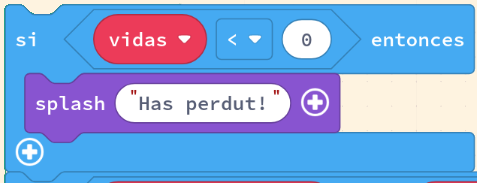
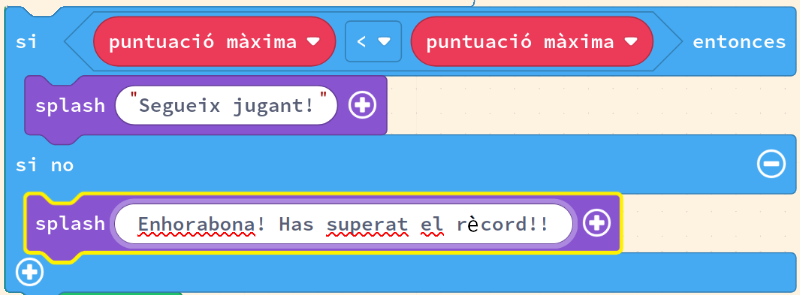
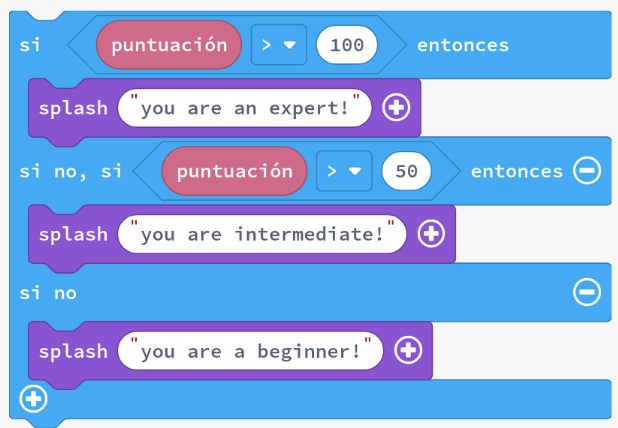
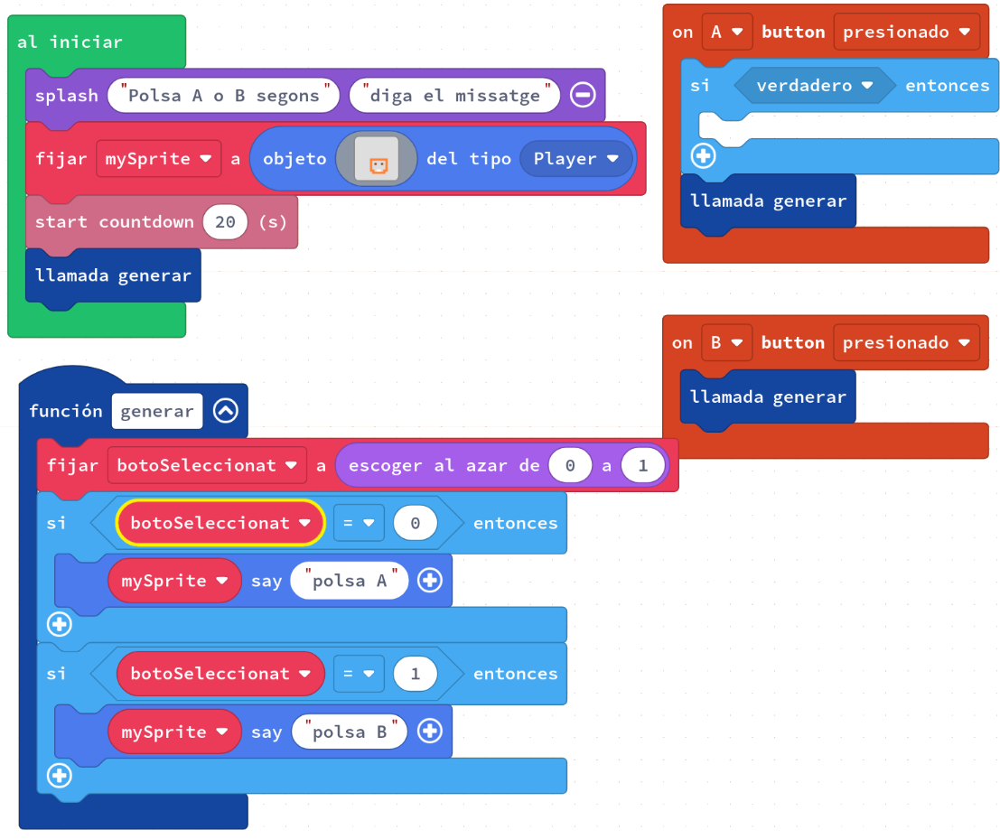
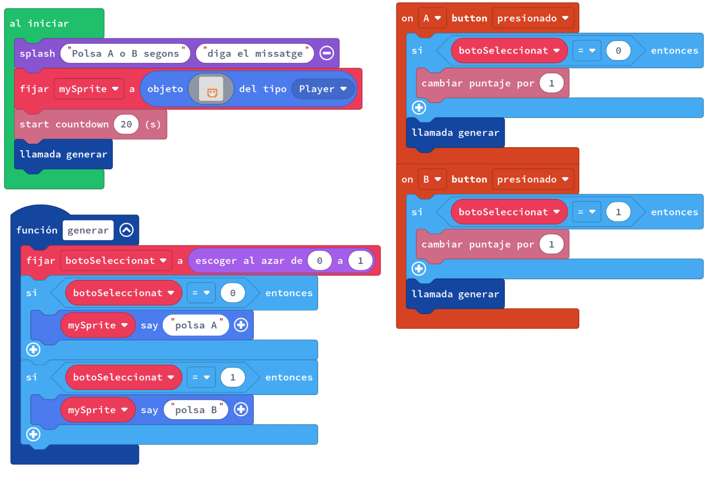
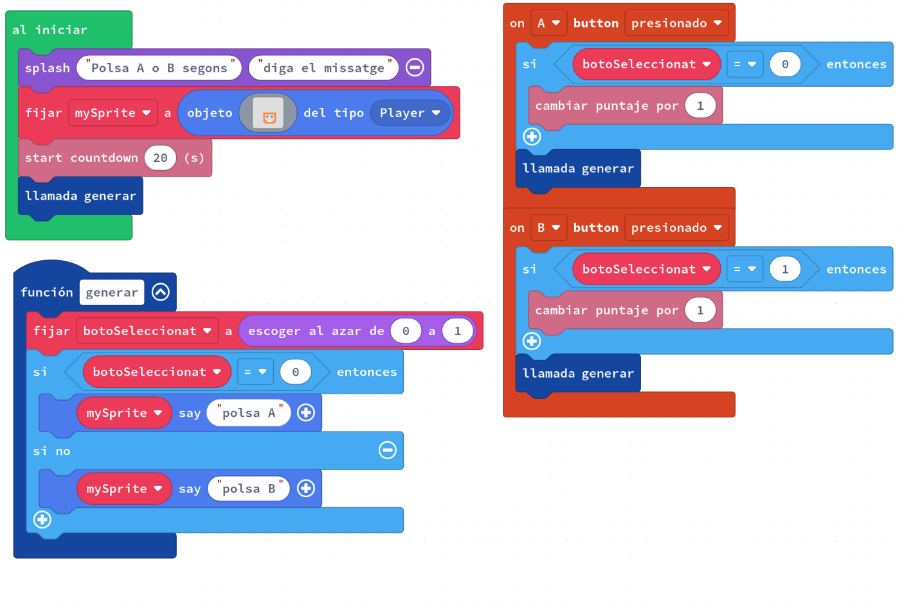
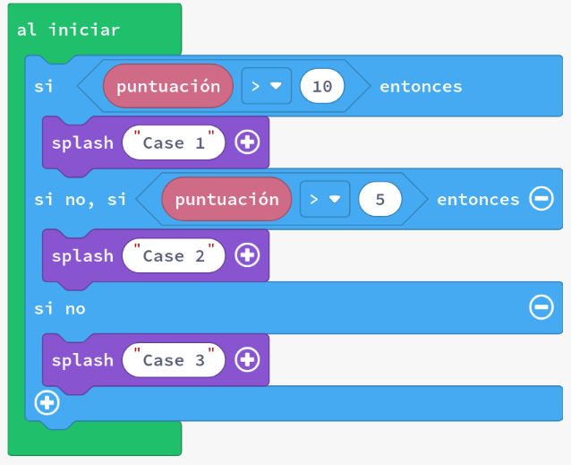
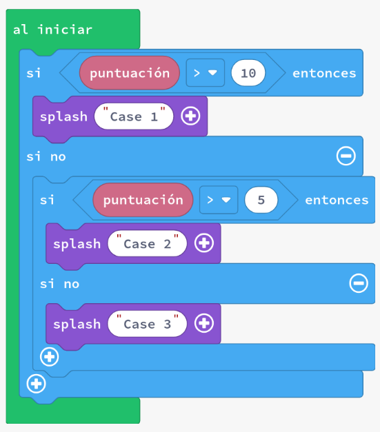

# Comparacions amb `si` i `si no`

En els nostres jocs sovint voldrem comparar valors i prendre una acció basada en el resultat de la comparació.

> **Exemple**: ¿És el meu valor més petit que un valor de prova? Si és cert que el meu valor (_3_) és més petit que el valor de prova (_5_), llavors afegirem al meu valor. En cas contrari, restarem del valor.

Podríem fer una prova de comparació per veure:

- Si la puntuació del jugador és més gran que la puntuació de l'enemic, llavors guanyem punts en la superposició.
- Si el jugador té 0 vides, llavors posem fi al joc.
- Si tenim la clau secreta, llavors podem entrar a la sala.

Les sentències `si` i `si no` ens permeten fer que els nostres programes es comportin de maneres diferents en funció de l'estat del joc.

En aquesta activitat veurem:

- `si`
- `si no`
- `si no, si`

## Concepte: Blocs `si` i `si no`

En la lliçó anterior hem vist que les sentències `si` fan una prova i si la prova lògica s'avalua com a certa, llavors s'executarà el codi que s'ha donat.

Quan utilitzem una sentència `si`, tenim l'opció d'afegir una sentència `si no`. Un bloc `si no` només s'executarà si la prova lògica donada s'avalua com a falsa. En altres paraules, si la prova és certa, llavors s'executarà el codi del bloc `si`, si no, s'executarà el codi del bloc `si no`.

## Concepte: Bloc `si no, si`

Usant un bloc `si` amb un bloc `si no` ens permet dividir totes les comparacions en dues categories: o la comparació és certa o falsa (no certa).

Què passa si necessitem dividir una comparació en tres o quatre categories?

Podem utilitzar el bloc `si no, si` per afegir comparacions addicionals.

Fent clic al signe més d'un bloc `si` apareixerà un bloc `si no, si`. Això permet una altra prova lògica que divideix els casos després que la prova lògica original s'avaluï com a falsa.

Podem comparar la puntuació amb 3 possibles resultats.

Per exemple, considerem el cas en què volem dividir les puntuacions en tres grups: principiant, intermedi i expert.

- Si la puntuació és superior a 100, llavors l'usuari és un expert.
- Si la puntuació és superior a 50, llavors l'usuari és intermedi.
- En la resta de casos, l'usuari és principiant.

Aquest codi primer comprovarà si la puntuació més alta del joc és superior a 100. Si ho és, llavors identificarà el jugador com a "expert" i saltarà la resta de proves de comparació.

Si no és superior a 100, llavors s'executarà la segona prova lògica per veure si la puntuació és superior a 50. Si ho és, llavors identificarà el jugador com a "intermedi".

Si no és superior a 50, s'executarà la secció `si no` i classificarà el jugador com a "principiant".

## Concepte: Gestió de botons

Vejam com podem aprofitar les funcions, les variables i les comparacions per a gestionar els botons en un joc.

Crea un projecte nou a Arcade i, per cadascun dels exemples següents copia el codi a l'editor de MakeCode Arcade i executa'l (els canvis són petits entre els exemples). Observa les diferències en el comportament del joc.

### Exemple #1a: Missatge aleatori

### Exemple #1b: Verifica el botó premut

### Exemple #1c: Utilització de `si no`

---

### Tasca #1a: Utilització de `si no` amb una resposta incorrecta

1. Comença amb el codi de l'exemple **#1c** de dalt.
2. Afegeix sentències `si no` als esdeveniments de pressió del botó que executin codi quan el jugador polsa el botó incorrecte.
3. Disminueix la puntuació del jugador en 1 quan premi el botó incorrecte.

### Tasca #1b: Missatge de fi de joc

Per finalitzar, agregarem un missatge de felicitació al final del joc; depenent de la puntuació del jugador, el missatge serà diferent.

1. Crea un esdeveniment per a quan el temps s'acabi utilitzant el bloc `cundo termine la cuenta regresiva`.
2. Comprova si la puntuació del jugador és inferior a 20. Si ho és, utilitza un bloc `splash` per a mostrar el missatge "Puntuació de principiant: " i la puntuació del jugador.
3. Utilitza un bloc `si no` per a fer el mateix si la puntuació del jugador és igual o superior a 20, però mostra el missatge "Puntuació de pro: " i la puntuació del jugador.
4. Utilitza un bloc `game over` per a indicar que el joc ha acabat i que el jugador ha guanyat.
5. En un bloc `game over`, pots indicar si el jugador ha guanyat o no. Això canviarà el diàleg que es mostra a la pantalla de finalització del joc.
6. **Repte**: fes que l'_sprite_ tingui un efecte de sacseig o cop cada vegada que parli per a visualitzar quan s'actualitze el text, fins i tot quan és la mateixa que la vegada anterior.

---

## Avaluació

Crea un document i:

- Quin és un cas en què utilitzes un `si`, però no un `si no`?
- Per exemple, en l'exemple **#1c**, vam canviar l'estructura `si - si` a una estructura `si sinó`. Per què té sentit fer això?
- Què és el mateix i què és diferent entre els següents exemples de codi? Quin és més fàcil de llegir? Explica.

  1. 
  2. 

- Què passaria si no tinguéssim cap bloc `si no` en el codi de l'exemple **#1c**? Quin seria el resultat?

**Puja el document a l'aula virtual (tasca 1.4.4).**
