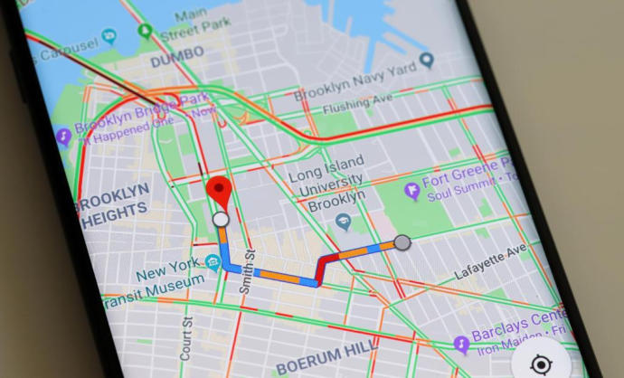
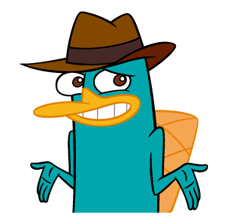

# Pensament Computacional

---

## Abans de començar...

<!--
Comencem plantant un problema real, que els alumnes hauran de resoldre en grups de 4. El problema és el següent: un familiar o un amic no és capaç d'utilitzar Youtube de forma correcta, i no pot posar la cançó Caminando por la vida de Melendi. La tasca dels alumnes és explicar tots els passos, de la forma més precisa possible, a aquest familiar per acabar escoltant a Melendi. Tenen 5 minuts per establir cada pas, i després altres 5 per parlar amb un grup de 4 companys i veure com han estructurat els passos i a quin nivell.
-->

---

## Com han segut les instruccions?

- **Finites**: Arribarem o no a la solució, pero acabarem la tasca.
- **Precises**: Si no especifiquem bé, el familiar no podrà escoltar la cançó.
- **Ordenades**: Les instruccions han de seguir un ordre concret.
- **Sense ambigüitats**: Ha de quedar clar què s'ha de fer en cada pas.

---

## Pensament Computacional

> El pensament computacional inclou resoldre problemes, dissenyar sistemes i entendre el comportament humà, basant-se en conceptes fonamentals de la informàtica [...] inclou eines mentals que reflecteixen l'amplada del camp de la informàtica

Jeannette Wing

---

## Capacitats del Pensament Computacional

1. **Descomposició**:
    - Dividir el problema en parts més petites.
2. **Reconeixement de patrons**:
    - Identificar similituds entre problemes diferents.
3. **Abstracció**:
    - Identificar els aspectes importants d'un problema.
4. **Algorísmica**:
    - Dissenyar i implementar algorismes per resoldre problemes.

---

## Quan s'utilitza el Pensament Computacional en el dia a dia?

- Buscant un contacte a la llibreta de contactes.
- Quan anem a pagar a una botiga i hem de seleccionar la filera més ràpida.
- Quan solucionem un problema de matemàtiques.
- Quan juguem a un joc de taula.
- Quan busquem una cançó a Spotify.

#### Algún exemple més?

---

## Pensen els ordinadors?

- El computador no pot pensar com un ésser humà.
- El seu comportament és determinista i be donat per un conjunt d'instruccions (algorismes).
- Els ordinadors no poden resoldre problemes per si sols, necessiten que els humans els programin.
- Els algorismes han de ser clars, precisos i sense ambigüitats (com les instruccions per escoltar Melendi).

---

## Algorismes del dia a dia

---

## Activitat

1. **Dividim-nos en grups de 4**.
2. **Cada grup haurà de resoldre un dels següents problemes**:
    - Com arribar a l'Institut Benigasló des de l'ajuntament.
    - Com fer una reserva a un restaurant.
    - Com pujar un vídeo a TikTok.
3. **Cada grup haurà de presentar la seva solució**.

---

## Dibuixem com un ordinador

- Activitat en parelles.

<!--
Aquesta activitat és la darrera de la primera sessió: els alumnes es distribuiran en parelles, on un prendrà el rol d'ordinador i l'altre donarà les instruccions perquè el robot faci dos dibuixos: un més senzill de Kenny de South Park, i un altre de Perry l'Ornitorrinc de la sèrie de dibuixos Phineas i Ferb. Les instruccions que ha de donar l'alumne que faci de usuari han de ser el més precises possibles perquè els dibuixos surtin bé, ja que l'alumne que faci d'ordinador ha de fer exactament el que se li diu. Un cop passats 10 minuts es canviaran els rols. Durant els últims 5 minuts es posarà en comú les experiències dels alumnes i les dificultats que han tingut al rebre o donar instruccions.
-->

