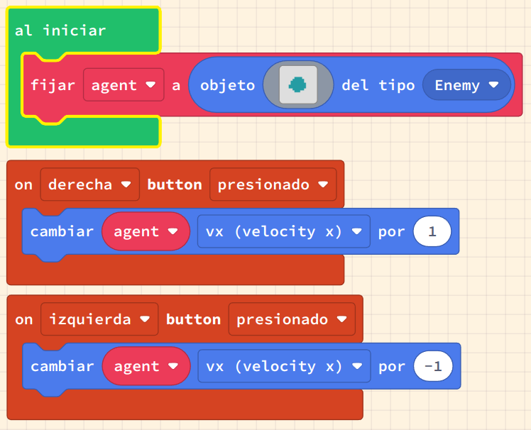

# Movem sprites per la pantalla

El moviment és el canvi de posició. Per fer que els sprites es moguin, canviarem la seva posició utilitzant un esdeveniment de controlador de joc. El controlador té esdeveniments de control per als botons d'`amunt`, `avall`, `esquerra` i `dret`.

Podem utilitzar aquests esdeveniments per canviar la ubicació de l'sprite, i per fer que l'sprite es mogui. També veurem com donar a un sprite una velocitat de moviment, o velocitat. La velocitat és la taxa de canvi de la nostra posició - a la vida real, sovint es mesura com a quilòmetres per hora o milles per hora.

Quan les velocitats d'un sprite no són zero, llavors l'sprite estarà en moviment.

En aquestes activitats, utilitzarem:

- Esdeveniments del controlador
- Incrementar les coordenades `x` i `y`
- Métodes i funcions curtes per al moviment
- Mantenir-se a la pantalla

## Concepte: Moviment d'un sprite

### Tasca #1: Incrementar la posició a l'esquerra i a la dreta

1. Crea un nou projecte a Arcade i posa-li el nom _moviment_.
2. Copia el codi de l'exemple a l'editor de MakeCode Arcade i executa'l.
3. Agrega codi addicional per controlar els moviments d'amunt i avall (direcció Y) utilitzant el controlador
4. Afegiu un esdeveniment de botó A per moure l'sprite al centre de la pantalla del joc
5. Afegiu un esdeveniment de botó B per fer que l'sprite "salti" (es mogui) 15 píxels

## Concepte: Velocitat d'un sprite

La velocitat és la velocitat en una direcció particular. En els nostres jocs normalment seguim el moviment en les direccions `X` i `Y`.

Si tenim una velocitat `X` positiva, per exemple, llavors el nostre sprite continuarà augmentant en `X`, fent que es mogui cap a la dreta a través de la pantalla.

### Tasca #2: Incrementar la velocitat

1. Copia el codi de l'exemple a l'editor de MakeCode Arcade i executa'l.
2. Afegiu codi addicional per controlar les velocitats d'amunt i avall (direcció Y) utilitzant el controlador.
3. Repte: Afegiu un esdeveniment de botó A per moure l'sprite al centre de la pantalla del joc.
4. Repte: Afegiu un esdeveniment de botó B per fer que l'sprite es pari (totes les velocitats = 0).

## Concepte: Controlador

Hem creat moviment capturant els esdeveniments del teclat i incrementant (o decrementant) una coordenada de ubicació o una velocitat. Ara que hem vist com funciona això per als quatre botons direccionals, podem utilitzar un mètode més curt per gestionar això.

### Tasca #3: Utilitzar el bloc de controlador

1. Copia el codi de l'exemple a l'editor de MakeCode Arcade i executa'l.
2. Fixa't com no cal especificar quasi res per a fer que l'sprite es mogui; el bloc de controlador (_mover sprite con botones_) fa tot el treball. 
3. Explora el menú del controlador per _moure sprite amb els botons_ i selecciona el signe més al bloc per veure vx 100 i vy 100   
4. Prova a canviar els valors de vx i vy per veure com canvia el moviment de l'sprite
5. Fes que l'sprite es mantingui dins dels límits de la pantalla

**Repte**: afegiu esdeveniments de botó que aturin el moviment de l'sprite i el restableixin al centre de la pantalla

{: .nota }
> **Pista:**
> El bloc _permanecer en la pantalla_ es troba al menú _Sprites_.

### Avaluació

Fes un document amb les respostes a les següents preguntes:

- Descriu com els events poden ser utilitzats per executar codi utilitzant un exemple.
- Descriu la diferència entre canviar la posició i canviar la velocitat.
- Què passa si la velocitat de l'sprite és 0?

**Puja el document a l'aula virtual (tasca 1.5).**