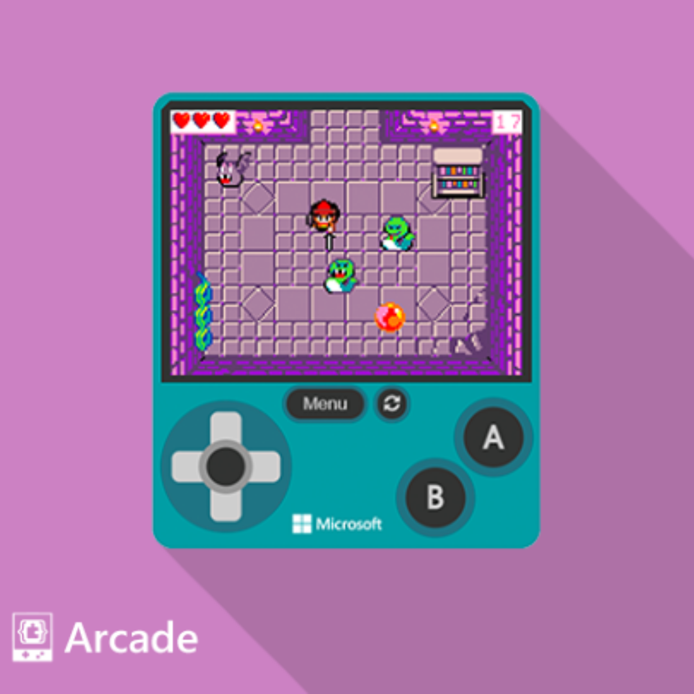
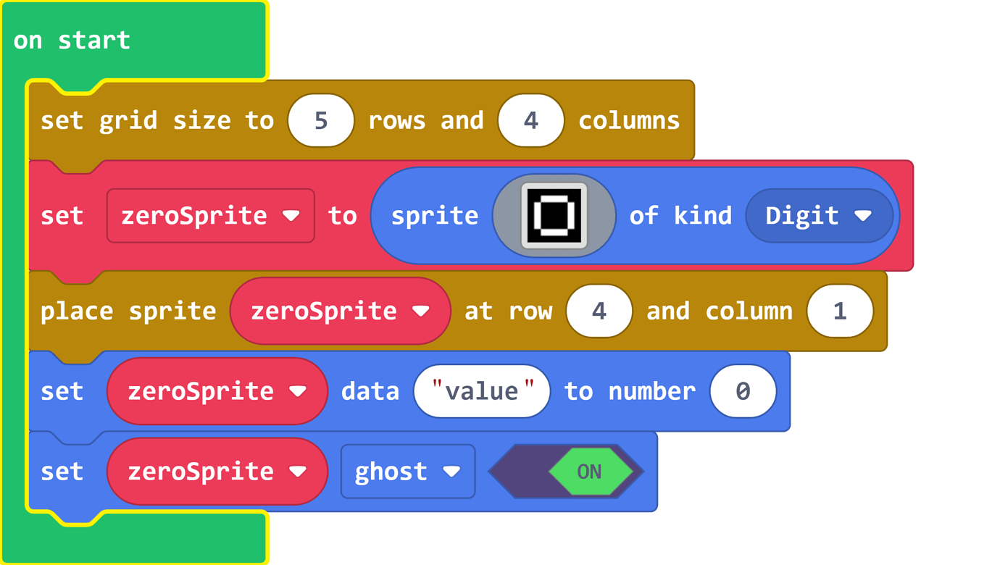
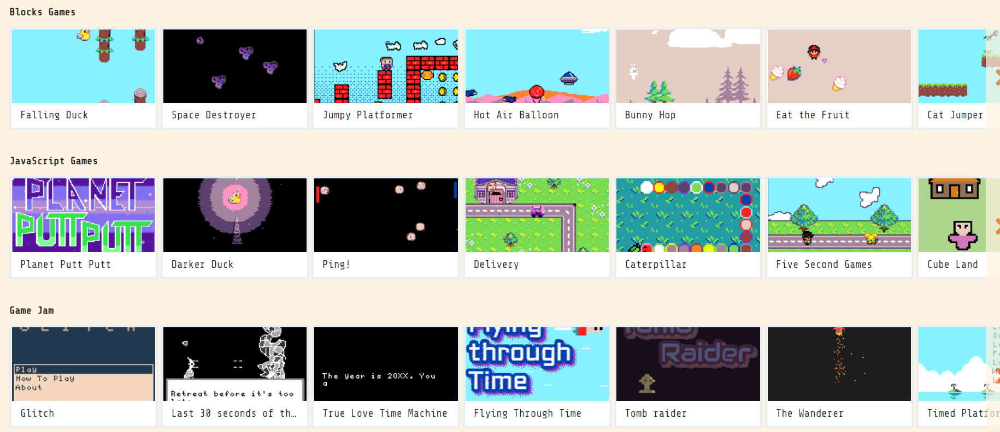
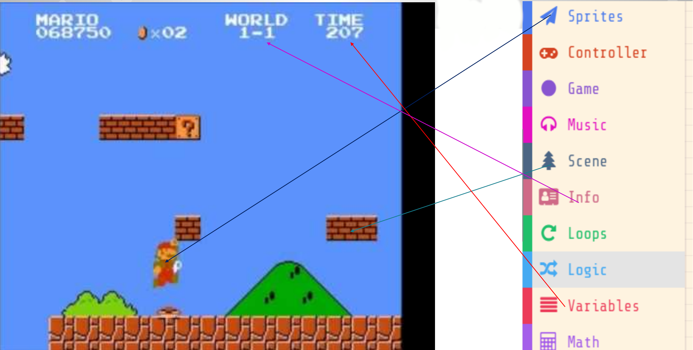

# Introducció a MakeCode Arcade

---

## Què és MakeCode Arcade?

- **MakeCode Arcade** és un entorn de programació visual per a la creació de videojocs.
- Aquesta eina permet als alumnes crear jocs senzills i interactius, i així aprendre els conceptes bàsics de la programació.

---

## Per què MakeCode Arcade?

- **Fàcil d'aprendre**: programació visual amb blocs.
- **Divertit**: crear jocs senzills i interactius.
- **Creatiu**: personalitzar els jocs amb imatges i sons.
- **Col·laboratiu**: compartir els jocs amb altres alumnes.

---

## Què podem fer amb MakeCode Arcade?

- **Crear jocs senzills**: jocs de plataformes, puzles, laberints...
- **Personalitzar els jocs**: afegir imatges, sons i efectes.
- **Compartir els jocs**: jugar-los amb altres alumnes.

       

---

## Com funciona MakeCode Arcade?

1. **Blocs de codi**: arrossegar i deixar anar blocs per programar. Una forma senzilla d'aprendre a programar.
2. **Simulador**: provar el joc abans de descarregar-lo. Comprovar que tot funciona correctament.
3. **Consola real**: guardar el joc en un fitxer .uf2 per jugar-lo en una consola real!.

---

## Que fan els blocs de codi?

  

---

## Activitat

- Per parelles entreu a [MakeCode Arcade](https://arcade.makecode.com/) i exploreu l'exemple _Jumpy Platform_.
- Reviseu els blocs de codi i les diferents parts del joc, anotant perquè serveix cada bloc.
- Intenteu modificar el joc canviant la imatge del personatge, la velocitat de salt, la gravetat, etc.
- Què heu après? Què us ha costat més? Què us ha agradat més?