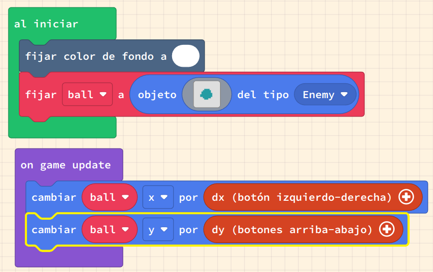

# Movem sprites per la pantalla

El moviment és el canvi de posició. Per fer que els sprites es moguin, canviarem la seva posició utilitzant un esdeveniment de controlador de joc. El controlador té esdeveniments de control per als botons d'`amunt`, `avall`, `esquerra` i `dret`.

Podem utilitzar aquests esdeveniments per canviar la ubicació de l'sprite, i per fer que l'sprite es mogui. També veurem com donar a un sprite una velocitat de moviment, o velocitat. La velocitat és la taxa de canvi de la nostra posició - a la vida real, sovint es mesura com a quilòmetres per hora o milles per hora.

Quan les velocitats d'un sprite no són zero, llavors l'sprite estarà en moviment.

En aquestes activitats, utilitzarem:

- Esdeveniments del controlador
- Incrementar les coordenades `x` i `y`
- Establir la velocitat `vx` i `vy`
- Métodes i funcions curtes per al moviment
- Mantenir-se a la pantalla

## Concepte: Moviment d'un sprite

### Tasca #1: Incrementar la posició a l'esquerra i a la dreta

1. Crea un nou projecte a Arcade i posa-li el nom _movimentED_.
2. Copia el codi de l'exemple a l'editor de MakeCode Arcade i executa'l.
3. Agrega codi addicional per controlar els moviments d'amunt i avall (direcció Y) utilitzant el controlador
4. Afegiu un esdeveniment de botó A per moure l'sprite al centre de la pantalla del joc
5. Afegiu un esdeveniment de botó B per fer que l'sprite "salti" (es mogui) 15 píxels

## Concepte: Velocitat d'un sprite

La velocitat és la velocitat en una direcció particular. En els nostres jocs normalment seguim el moviment en les direccions `X` i `Y`.

Si tenim una velocitat `X` positiva, per exemple, llavors el nostre sprite continuarà augmentant en `X`, fent que es mogui cap a la dreta a través de la pantalla.

### Tasca #2: Incrementar la velocitat

1. Crea un nou projecte a Arcade i posa-li el nom _velocitatED_.
2. Copia el codi de l'exemple a l'editor de MakeCode Arcade i executa'l.
3. Afegiu codi addicional per controlar les velocitats d'amunt i avall (direcció Y) utilitzant el controlador.
4. Repte: Afegiu un esdeveniment de botó A per moure l'sprite al centre de la pantalla del joc.
5. Repte: Afegiu un esdeveniment de botó B per fer que l'sprite es pari (totes les velocitats = 0).

## Concepte: Acurtar el codi amb dx i dy

Hem creat moviment capturant els esdeveniments del teclat i incrementant (o decrementant) una coordenada de ubicació o una velocitat. Ara que hem vist com funciona això per als quatre botons direccionals, podem utilitzar un mètode més curt per gestionar això.

### Tasca #3: Utilitzar dx i dy

1. Crea un nou projecte a Arcade i posa-li el nom _dx_dy_.
2. Copia el codi de l'exemple a l'editor de MakeCode Arcade i executa'l.
3. Fixa't en el bloc `on game update` que fa que s'execute codi cada vegada que el joc s'actualitza.
4. Explora el menú del controlador per moure mySprite amb els botons i selecciona el signe més al bloc per veure vx 100 i vy 100   
5. Canvia el moviment del teclat per utilitzar el bloc descobert col·locant-lo en _al iniciar_
6. Make the sprite stay in the screen boundary
6. Fes que l'sprite es mantingui dins dels límits de la pantalla
7. Repte: afegiu esdeveniments de botó que aturin el moviment de l'sprite i el restableixin al centre de la pantalla

{: .nota }
> **Pista:**
> El bloc _permanecer en la pantalla_ es troba al menú _Sprites_.

### Avaluació

Fes un document amb les respostes a les següents preguntes:

- Descriu com els events poden ser utilitzats per executar codi utilitzant un exemple.
- Descriu la diferència entre canviar la posició i canviar la velocitat.
- Què fa el bloc `on game update`?

**Puja el document a l'aula virtual (tasca 1.5).**