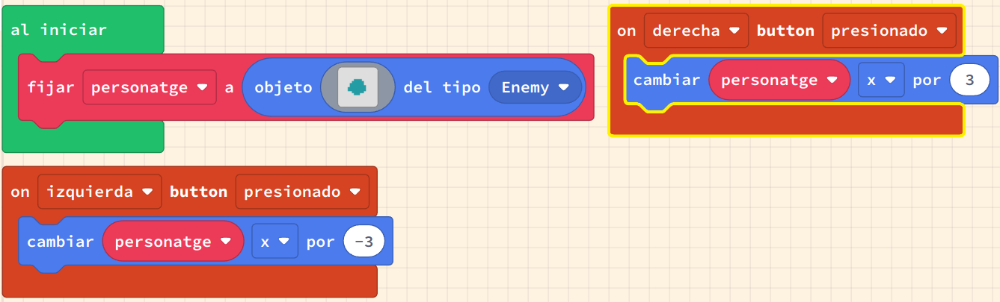

# Movem sprites per la pantalla

El moviment és el canvi de posició. Per fer que els sprites es moguin, canviarem la seva posició utilitzant un esdeveniment de controlador de joc. El controlador té esdeveniments de control per als botons d'`amunt`, `avall`, `esquerra` i `dret`.

Podem utilitzar aquests esdeveniments per canviar la ubicació de l'sprite, i per fer que l'sprite es mogui. També veurem com donar a un sprite una velocitat de moviment, o velocitat. La velocitat és la taxa de canvi de la nostra posició - a la vida real, sovint es mesura com a quilòmetres per hora o milles per hora.

Quan les velocitats d'un sprite no són zero, llavors l'sprite estarà en moviment.

En aquestes activitats, utilitzarem:

- Esdeveniments del controlador
- Incrementar les coordenades `x` i `y`
- Establir la velocitat `vx` i `vy`
- Métodes i funcions curtes per al moviment
- Mantenir-se a la pantalla
- Reflexar (i canviar) imatges

## Exemple #1: Incrementar la posició a l'esquerra i a la dreta

### Avaluació

Fes un document amb les respostes a les següents preguntes:

- Que ha dit el bloc _miSprite decir_ quan l'has afegit al joc de la tasca #2?
- Compara i contrasta les dues maneres diferents que hem guardat el nostre joc; quins són els avantatges de cada elecció? Quina creus que utilitzaries si volguessis enviar un joc que has fet al teu amic per correu electrònic, i per què prendries aquesta decisió?
- Inclou la imatge creada a la tasca #2.
- Inclou l'enllaç creat a la tasca #4.

**Puja el document a l'aula virtual (tasca 1.2).**