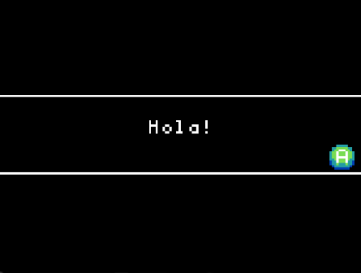

# Inicialització



Aquesta activitat comença amb els conceptes bàsics necessaris per començar amb JavaScript en Arcade, establint variables i mostrant-les a l'usuari.

## Exemple #1: Pantalla de Benvinguda

El bloc `splash` permet que aparegui un missatge en pantalla perquè el jugador el llegeixi i després el descarti amb una pulsació de botó.

Per utilitzar el bloc `splash`, simplement escriu `game.splash` i el missatge que vols mostrar entre cometes. Per exemple, el següent codi mostra un missatge de benvinguda:

```python
game.splash("Hola!")
```

Llegeix atentament el codi Python per identificar les següents parts:

- `game.splash()`: `splash` és la funció que es crida i `game` és el mòdul que conté la funció; ja veurem més endavant què són els mòduls.
- `Hola!`: La cadena que es passa a la funció.
- `""`: Envolta la cadena per identificar-la com a cadena.

## Tasca #1: Hola Món!

1. Crea un nou projecte en Arcade.
2. Reprodueix el codi de l'exemple #1.
3. Canvia la paraula **"Hola!"** per la frase **"Hola Món!"**.
4. Executa el codi per verificar que la sortida ha canviat.

## Exemple #2a: Ús de Variables

Les variables permeten que el codi es pugui canviar fàcilment segons sigui necessari per al teu joc. En Python, les variables són declarades amb el nom de la variable seguit d'un signe igual i el valor que vols assignar-li.

Per exemple, el següent codi crea una variable anomenada `missatge` i li assigna el valor de la cadena `"Hola Món!"`:

```python
missatge = "Hola Món!"
```

En el codi anterior, la variable `missatge` conté la cadena `"Hola Món!"`.

Per utilitzar la variable simplement escriu el nom de la variable en lloc de la cadena. Per exemple, el següent codi mostra el contingut de la variable `missatge`:

```python
game.splash(missatge)
```

## Exemple #2b: Variable de Cadena vs. Cadenes

Les variables de cadena són útils per a guardar valors que es poden canviar. Per exemple, si vols canviar el missatge de benvinguda, simplement has de canviar el valor de la variable `missatge` en lloc de canviar totes les instàncies de la cadena `"Hola Món!"`.

En l'exemple #2a, la variable es va passar directament a la funció `game.splash`.

Referenciar la variable es fa sense envoltar-la amb cometes. Si intentes envoltar-la amb cometes, s'identificarà com una cadena.

El següent és gairebé idèntic al codi de l'exemple #2a, però té una sortida completament diferent. Abans d'executar el codi, identifica què es mostrarà en pantalla.

```python
game.splash("missatge")
```

## Tasca #2: Creació de Variables

1. Crea un nou projecte en Arcade
2. Declara una nova variable anomenada `gos` i assigna-li el valor `"Guau!"`
3. Declara una altra nova variable anomenada `gat` i assigna-li el valor `"Miau"`
4. Declara una altra nova variable anomenada `gat_i_gos` i assigna-li el valor `"Miau i Guau!"`
5. Utilitza `game.splash` per mostrar `gos` a l'usuari
6. Utilitza `game.splash` per mostrar `gat` a l'usuari
7. Utilitza `game.splash` per mostrar `gat_i_gos` a l'usuari

{:.nota}

> Les variables en Python solen definir-se de la forma anomenada **snake_case**, és a dir, amb lletres minúscules i separades per guions baixos.
> Per exemple, si volem guardar el nom de la nostra mascota, la variable es podria anomenar `nom_mascota`.

## Exemple #3: Reassignació de variables

Les variables només es poden declarar una vegada. Això significa que no pots declarar dues variables amb el mateix nom, per exemple:

```python
missatge = "hola"
missatge = "adeu"
```

En el codi anterior, la variable `missatge` es declara dues vegades. Això no crearà un error, però sobreescriurà el valor de la variable `missatge` amb el valor `"adeu"`.

Les variables es poden reassignar en qualsevol moment tantes vegades com sigui necessari. Per exemple, el següent codi reassigna la variable `missatge` amb el valor `"Hola Món!"` i després amb el valor `"Adeu Món!"`:

```python
missatge = "Hola Món!"
game.splash(missatge)
missatge = "Adeu Món!"
game.splash(missatge)
```

## Avaluació

Crea un document i:

- Responeu a les següents preguntes:
  - Explica la diferència entre declarar una variable i assignar un valor. Pot ser útil intentar trobar una analogia.
  - En la tasca #3, la mateixa variable es va mostrar dues vegades, amb resultats diferents. Explica que va fer que els resultats fossin diferents.
- Resol els següents exercicis curts i pega el codi en el document:
  - Crea una variable anomenada `nom` i assigna-li el teu nom.
  - Mostra per pantalla el nom del teu equip esportiu favorit.
  - Crea una variable anomenada `raça` i assigna-li el nom d'una raça de gos. Mostra per pantalla el nom de la raça del gos utilitzant la variable `raça`.
  - Crea les variables `vaca` i `serp` i assigna'ls els valors `"Mu!"` i `"Sssss!"` respectivament. Mostra per pantalla el so que fa una vaca i una serp utilitzant les variables `vaca` i `serp`.
  - En la variable `gelat`, assigna-li el teu sabor de gelat preferit. Mostra per pantalla el teu sabor de gelat preferit. Sobreescriviu la variable `gelat` amb el sabor de gelat preferit d'un company de classe i mostreu el sabor de gelat preferit del company de classe.
  - You’re listening to music and you don’t know what songs to play. You remember your friend has great taste in music so you ask them to store the title of their favorite song as a string in a variable called favSong. Since you trust their music taste, you want to listen to their favorite song next. What code would you write to create another string variable called nextSong and set it to the value of your friend’s favorite song?.
  - Pregunta a un company de classe quina és la seva cançó preferida i guarda-la en una variable anomenada `canço_preferida`. Si en `canço_següent` volem marcar que la cançó següent serà la cançó preferida del company de classe, com ho faríem?

**Puja el document a l'aula virtual (tasca 2.1.1).**
