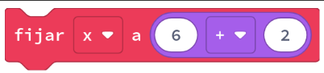
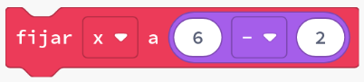
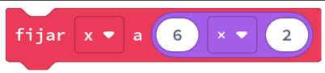
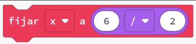
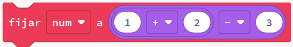
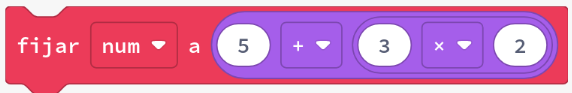
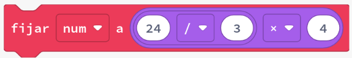
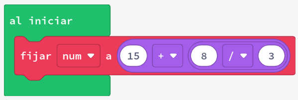

# Matemàtiques


En Blocs, cada pas d'una equació necessitava el seu propi bloc. Això pot fer que les fórmules siguen difícils d'expressar correctament, ja que pot ser difícil identificar (o canviar) l'ordre en què es calculen.

En JavaScript, les mateixes fórmules poden ser més fàcils d'expressar, ja que la sintaxi (estructura) és molt més semblant a la que s'utilitza quan es calcula matemàtiques a mà o amb una calculadora científica.

| Operació      | Bloc                           | Python      |
| ------------- | ------------------------------ | ----------- |
| Suma          |     | `x = 6 + 2` |
| Resta         |   | `x = 6 - 2` |
| Multiplicació |     | `x = 6 * 2` |
| Divisió       |  | `x = 6 / 2` |

## Exemple #1: Expressions complexes

1. Revisa els exemples següents
2. Identifica què és diferent entre els Blocs i el Python en cada parell
3. Executa els exemples: identifica quin serà el resultat final (pot ser útil afegir `game.splash` per mostrar el valor)

### Exemple #1a: Suma i resta



```python
num = 1 + 2 - 3
```

### Exemple #1b: Suma i multiplicació



```python
num = 5 + 3 * 2
```

### Exemple #1c: Divisió i multiplicació



```python
num = 24 / 3 * 4
```

## Tasca #1: Adaptar expressions fetes en blocs

1. Crea un nou projecte en Arcade. Ves a la vista **Python**
2. Recrea l'expressió següent en **Python**
   
3. Per confirmar que l'expressió Python és correcta, canvia a Blocs i comprova que el resultat és el mateix
4. **Repte:** canvia el `+` per un `×`, i torna a Python. Què ha canviat?

## Concepte: Ordre de les operacions

JavaScript utilitza una estructura **PEMDAS** per determinar l'ordre en què es calculen les operacions. Això significa **P**arèntesis, **E**xponents, **M**ultiplicació o **D**ivisió, **A**ddició o **S**ubtracció.

| Ordre | Operació      |
| ----- | ------------- |
| 1r    | Parèntesis    |
| 2n    | Exponents     |
| 3r    | Multiplicació |
|       | Divisió       |
| 4t    | Addició       |
|       | Subtracció    |

Les operacions del primer ordre es produiran abans que les operacions del segon ordre, les operacions del segon ordre es produiran abans que les operacions del tercer ordre, i les operacions del tercer ordre es produiran abans que les operacions del quart ordre.

Les operacions que són del mateix ordre (per exemple, multiplicació i divisió) es completaran d'esquerra a dreta. Això significa que `24 / 3 * 4` es calcula com `32`, perquè `24` es divideix per `3`, i després el resultat es multiplica per `4`.

Els parèntesis tenen l'ordre més alt, el que significa que sempre es calculen primer. Això es pot utilitzar per controlar l'ordre en què es calcula una expressió. Per exemple, `24 / (3 * 4)` es calcularà com `2`, perquè els parèntesis requereixen que `3 * 4` es calcule primer, abans que es produïsca la divisió.

## Exemple #2: Utilitzant PEMDAS

1. Revisa els exemples següents
2. En cada exemple, identifica com es canvia el valor de `num` utilitzant l'ordre de les operacions

### Exemple #2a: Resta i divisió

```python
num = 10 - 6 / 2
print(num)
```

Això imprimirà el número 7, perquè la divisió es produeix abans que la resta.

Si, en canvi, l'objectiu és restar abans de dividir, es poden utilitzar parèntesis per canviar l'ordre

```python
num = (10 - 6) / 2
print(num)
```

Això imprimirà el número 2, en canvi.

### Exemple #2b: Divisió i multiplicació

```python
num = 24 / 3 * 4
print(num)
```

Això imprimirà el número 32, perquè la divisió es produeix abans que la multiplicació.

Si, en canvi, l'objectiu és multiplicar primer, l'equació es pot canviar utilitzant parèntesis

```python
num = 24 / (3 * 4)
print(num)
```

Això imprimirà el número 2, en canvi.

## Tasca #2: Corregir una expressió

1. Crea un nou projecte en Arcade. Ves a la vista **Python**.
2. Recrea l'expressió següent:
   ```python
    num = 18 * 6 + 4 / 2 - 1
    game.splash(num)
   ```
3. Recrea el codi següent.
4. Executa el codi i identifica quin valor emmagatzema `num`.
5. L'objectiu del nostre codi és el següent:
   1. Agregar 6 a 4 = 10
   2. Dividir el resultado por 2 = 5
   3. Restar 1 del resultado = 4
   4. Multiplicar el resultado por 18 = 72
6. Estem aconseguint el resultat esperat? Si no, modifica l'ordre en què es calcula **afegint parèntesis**. No afegiu ni elimineu cap altre operador o número.

## Avaluació

Crea un document i:

- Respon a les següents preguntes:
  - Quin és un avantatge d'escriure expressions en Python en lloc de blocs?
  - En Python, com es pot canviar l'ordre en què es calcula una expressió?
- Resol els següents exercicis curts i pega el codi en el document:
  - Seguint les següents instruccions utilitza variables per averiguar quantes fruites té cada persona:
    - Ramon té 5 pomes.
    - Cristina té 12 llimones.
    - Anna té 3 pomes més que Ramon.
    - Jordi té 2 llimones menys que Cristina.
    - Tomàs té el mateix nombre de taronges que llimones té Jordi restant el nombre de pomes que té Anna.
  - Calcula els resultats de les següents expressions:
    - 15391 + 4273 =
    - 87849383 ÷ 7481 =
    - 12589 + 2531 =
    - 72395941 ÷ 16063 =
    - 13577 - 8039 =
    - 9439 - 4831 + 8237 =
  - Agrega parèntesis a les següents expressions per obtenir el resultat correcte:
    - 9 - 5 - 3 = 7
    - 18 / 2 + 16 = 1
    - 13 - 3 - 7 = 17
    - 12 - 6 / 3 = 2
    - 12 - 7 + 1 = 4
    - 18 / 3 + 3 = 3

**Puja el document a l'aula virtual (tasca 2.1.4).**
