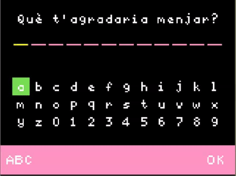

# Operadors d'assignació



**Operadors d'assignació** són assignacions que també realitzen una operació sobre la variable. S'utilitzen en Python per modificar el valor d'una variable sense haver de reassignar-la; això pot ser útil quan es vol incrementar o disminuir el valor d'una variable.

## Concepte: `cambiar <variable> por <valor>`

El bloc `cambiar <variable> por <valor>` s'utilitzava molt comunament per modificar el valor assignat a una variable quan es programava en Blocs. Ho hem fet moltes vegades, per exemple, per incrementar un comptador o per modificar la posició d'un personatge.

Això es pot aconseguir en Python utilitzant la variable mateixa en l'equació:

```python
num = num + 5
```

Això funciona perquè l'equació al costat dret de l'operador d'assignació es calcula primer, i el resultat d'aquesta equació s'assigna a la variable al costat esquerre.

Per exemple, si `num` emmagatzemava `4` abans del codi anterior, el costat dret de l'equació es calcularia primer a `9`, i després `num` seria **reassignat** `9` com el seu nou valor.

Modificar un valor d'aquesta manera és una tasca molt comuna, així que Python i altres llenguatges introdueixen l'operador `+=`, que **afegirà** el valor al costat dret al valor actualment emmagatzemat al costat esquerre.

Utilitzant l'operador `+=`, el codi d'exemple anterior també es pot escriure com:

```python
num += 5
```

Aquest procés de condensar l'expressió s'estén a tots els operadors, així que...

- `num -= 5` és equivalent a `num = num - 5`
- `num *= 5` és equivalent a `num = num * 5`
- `num /= 5` és equivalent a `num = num / 5`

Aquests es diuen **Operadors d'assignació**, com `=`.

## Exemple #1: Segons en una hora

1. Revisa el codi següent
   ```python
   segons = 1
   segons *= 60
   game.splash(str(segons) + " segons en un minut")
   segons *= 60
   game.splash(str(segons) + " segons en una hora")
   ```
2. Observa com s'utilitzen els operadors d'assignació per modificar la variable `segons`
3. Identifica els dos valors que són mostrats a la pantalla

## Tasca #1: Segons en una setmana

1. Comença amb el codi de l'exemple **#1**
2. Després del segon `game.splash`, utilitza un **operador d'assignació** per fer que `segons` emmagatzemi el nombre de segons en un dia
3. Mostra el nou valor de `segons` amb `game.splash`. Assegura't d'incloure una descripció del valor per coincidir amb els valors anteriors que van ser mostrats.
4. Utilitza un altre **operador d'assignació** per fer que `segons` emmagatzemi el nombre de segons en una setmana
5. Mostra el nou valor de `segons` amb `game.splash`, juntament amb la seva descripció corresponent
6. **Repte:** repeteix aquest procés tant per als segons en un mes, com per als segons en un any

{: .nota }

> Per al repte, pots utilitzar una estimació de 4 setmanes per mes i 12 mesos per any.

## Concepte: Increment i Decrement

En Python, és molt comú afegir o restar un d'un valor: per exemple, per comptar el nombre de vegades que es va prémer un botó, o l'índex en un bucle.

En Python, hi ha diversos **Operadors d'assignació** que poden fer això. Per exemple, tant `num = num + 1` com `num += 1` donaran com a resultat que `num` s'incrementi en 1.

Per contra, `num = num - 1` i `num -= 1` decrementaran `num` en 1.

## Exemple #2: Incrementant valors

1. Revisa el codi següent
   ```python
    nombre = 5
    game.splash(str(nombre) + " és massa baix!")
    nombre += 1
    nombre += 1
    game.splash(str(nombre) + " és massa alt!")
   ```
2. Abans d'executar el codi, identifica quins valors seran mostrats a la pantalla.

## Tasca #2: just aquest!

1. Comença amb el codi de l'exemple **#2**
2. Utilitza la forma condensada de **decrement** per baixar `nombre` en 1
3. Utilitza `game.splash` per mostrar el valor de `nombre` amb la descripció **" és just aquest!"**

## Concepte: Afegint cadenes

L'**Operador d'assignació** `+=` també pot ser útil quan s'afegeixen cadenes.

Els valors es poden **afegir** utilitzant l'operador `+=`. Per exemple, el següent fragment:

```python
missatge = "hola"
missatge = missatge + " món"
```

també es pot escriure:

```python
missatge = "hola"
missatge += " món"
```

Això permet que les cadenes es "construeixin" afegint peces a mesura que sigui necessari.

## Exemple #3: Comanda de menjar

1. Revisa el codi escrit a continuació

   ```python
   comanda = "M'agradaria menjar "
   menjar = game.ask_for_string("Què t'agradaria menjar?")
   comanda += menjar

   comanda += ". També m'agradaria beure "
   beure = game.ask_for_string("Què t'agradaria beure?")
   comanda += beure
   comanda += "."

   game.splash(comanda)
   ```

2. Abans d'executar el codi, identifica quin missatge serà mostrat a la pantalla

## Tasca de l'estudiant #3: Postres

1. Parteix del codi de l'exemple anterior
2. Modifica el codi perquè també pregunti a l'usuari **"Quin postre t'agradaria?"**
3. Afegeix a `comanda` la frase **" Per postres, m'agradaria "** seguida del postre que l'usuari ha demanat
4. Afegeix un "." per acabar la frase
5. **Repte:** en lloc d'emmagatzemar les variables `menjar`, `beure`, i `postre`, afegeix el resultat de `game.ask_for_string` directament a `comanda`. Assegura't que el resultat sigui el mateix.

## Què hem après?

Crea un document i:

- Respon a les següents preguntes:
  - Explica com els diferents operadors d'increment, decrement, i assignació poden ser útils per modificar una `variable`.
  - Quin és un avantatge d'utilitzar l'operador `+=` en lloc de `= variable + valor`?
  - Quins usos pràctics pots veure per a l'operador `+=` en el teu propi codi?
  - I per a l'operador `-=`?

**Puja el document a l'aula virtual (tasca 2.1.4).**
