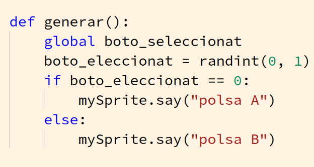
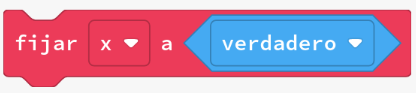
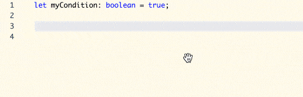

# Lògica



Just com en Blocs, fer servir el components lògics en Python permet que els jocs reaccionen a l'entrada de l'usuari i a l'estat del joc. Vejam com fer-ho en Python.

## Concepte: Variables booleanes

En blocs podíem guardar el valor lògic en una variable, per exemple:



en Python podem fer el mateix amb variables booleanes:

```python
condicio = True
```

o bé, si volem especificar el tipus de la variable:

```python
condicio: bool = True
```

## Concepte: Expressions `if` i `else`



Els blocs `if` i `else` eren alguns dels més importants per programar en blocs i les expressions equivalents segueixen sent igual d'importants en Python.

En Python això es pot expressar com:

```python
if condicio:
  print("La condició és vertadera")
```

i

```python
if condicio:
  print("La condició és vertadera")
else:
  print("La condició és falsa")
```

En aquests exemples, `condicio` és un valor booleà (una expressió que avalua a `true` o `false`). Com hem vist més maunt, en Blocs, aquestes sovint prenen la forma d'hexàgons allargats:


## Concepte: Comparacions

En Blocs, hi havia moltes maneres de comparar dos nombres. En Python, aquestes mateixes comparacions estan disponibles.

| Nom               | Símbol |       Python       |
| ----------------- | :----: | :----------------: |
| Igual a           |   =    | `value1 == value2` |
| Distint de        |   ≠    | `value1 != value2` |
| Menor que         |   <    | `value1 < value2`  |
| Menor o igual que |   ≤    | `value1 <= value2` |
| Major que         |   >    | `value1 > value2`  |
| Major o igual que |   ≥    | `value1 >= value2` |

## Exemple #1: Comparacions Numèriques

1. Repassa els dos exemples a continuació
2. Identifica quina comparació s'està fent en el `if`
3. Abans d'executar el codi, identifica què s'imprimirà amb `console.log` (si n'hi ha)
4. Executa els exemples i verifica les teves respostes al pas 3

### Exemple #1a: Menor que

```python
num = -5
if num < 0:
  print("num és negatiu!")
```

### Exemple #1b: Igual a

```python
num = 1
if num == 1:
  print("num és u!")
else:
  print("num no és u!")
```

Observa com el codi anterior utilitza la indentació per separar el codi contingut dins de cada bloc lògic. Això es fa per dues raons principals:

### Llegibilitat

Qualsevol persona pot mirar el codi i descifrar fàcilment què forma part de la sentència `if` i què no, fins i tot si mai ho han vist abans. La indentació proporciona una distinció visual per a on s'executaran diferents sentències.

### Funcionalitat

Python utilitza la indentació per determinar què forma part de la sentència `if` i què no. Això significa que la indentació incorrecta pot provocar errors en el codi.

Aixó és una de les característiques més importants de Python, i és una de les raons per les quals molts programadors el troben fàcil d'aprendre i llegir.

```python
num = 1
if num > 5:
  print("num és gran!")
  print("això significa que num no és petit")
  print("i num no és mitjà")
else:
  print("num no és gran!")
  print("això significa que num és petit")
  print("o num és mitjà")
```

## Tasca #1: Una Comparació Simple

1. Crea una variable que emmagatzemi un nombre
2. Utilitza una sentència `if` per comprovar si el nombre és menor que 2
3. Si la condició és vertadera (en la secció `if`), imprimeix “Hola!” a la consola
4. Si la condició és falsa (en la secció `else`), imprimeix “Adéu!” a la consola

## Concepte: Operadors Booleans

Els operadors booleans permeten manipular valors booleans.

| Nom | Ordre | Python            |
| :-: | :---: | ----------------- |
| No  |  1er  | `not bool1`       |
|  I  |  2n   | `bool1 and bool2` |
|  O  |  3er  | `bool1 or bool2`  |

Just com en matemàtiques, l'ordre de les operacions és important quan hi ha múltiples operadors usant-se alhora. Veurem com aquest ordre pot afectar el resultat d'una expressió.

### Exemple #2: Ordre dels Operadors Booleans

Avalua el valor emmagatzemat en la variable `bool4` donat el següent codi:

```python
bool1 = False
bool2 = True
bool3 = False

bool4 = bool1 and bool2 or not bool3
```

Seguint l'ordre de les operacions, el valor assignat a `bool4` s'avalua de la següent manera:

1. Es nega `bool3` per lo que avalua a `true`
2. S'avalua la expressió `bool1 and bool2`, que avalua a `false`, ja que `bool1` és `false`
3. Es verifica si `bool1` i `bool2` són `true` o el resultat del pas 2 (que avalua a `true`) és `true`
4. En resum tindríem `False and True or True`, que avalua a `True`, ja que `and` té més prioritat que `or`.
5. Finalment, `bool4` emmagatzema `True`.

Aquest resultat pot ser canviat afegint parèntesis:

```python
bool4 = bool1 and (bool2 or not bool3)
```

Seguint l'ordre de les operacions, el valor assignat a `bool4` s'avalua de la següent manera:

1. Es nega `bool3` per lo que avalua a `true`
2. S'avalua la expressió `bool2 or not bool3`, que avalua a `true`, ja que `bool2` és `true`
3. Es verifica si `bool1` i el resultat del pas 2 (que avalua a `true`) són `true`
4. En resum tindríem `False and True`, que avalua a `False`.
5. Finalment, `bool4` emmagatzema `False`.

## Exemple #3: Comparacions Numèriques

1. Repassa els dos exemples a continuació
2. Identifica quines comparacions s'estan fent en el `if`
3. Abans d'executar el codi, identifica què s'imprimirà amb `console.log` (si n'hi ha)
4. Executa els exemples i verifica les teves respostes al pas 3

### Exemple #3a: Major que i Igual a

```python
val1 = 5
val2 = 0

if val1 > 2 and val2 == 0:
  print("La condició és vertadera")
```

Aquesta expressió pot ser avaluada a mà dividint-la en subproblemes més petits. Vejam com seria el procés:

1. `val1 > 2` avalua a `true`
2. `val2 == 0` avalua a `true`
3. `true and true` avalua a `true`
4. La condició és vertadera, per tant, el missatge s'imprimeix a la consola.

### Exemple #3b: Major que o Igual a

```python
num = 5
bool = True

if num > 2 or bool:
  print("La condició és vertadera")
```

## Tasca #2: Múltiples Comparacions!

1. Crea dues variables per emmagatzemar dos nombres:
   - Variable `a` emmagatzema `7`
   - Variable `b` emmagatzema `8`
2. Utilitza una sentència `if` per realitzar **dues** comparacions sobre aquestes variables:
   - Primer, comprova que `a` és **menor que** 4
   - Després, comprova que `b` és **distint de** 9
   - Combina aquestes dues afirmacions utilitzant `or`
3. Si la condició és `true`, imprimeix “Ho has aconseguit!” a la consola
4. Si la condició és `false`, imprimeix “Intenta-ho de nou!” a la consola

## Avaluació

Crea un document i:

- Respon a les següents preguntes:

  - Explica per què les comparacions lògiques permeten que els jocs siguin més reactius a diferents condicions?
  - En Python, com pot canviar-se l'ordre en què s'avalua una expressió?
  - **Repte:** considera les següents expressions per a diferents valors de `bool1` i `bool2`. Quan seran iguals, quan seran diferents?

    - `not bool1 and not bool2`
    - `not (bool1 or bool2)`

- Resol els següents exercicis curts i pega el codi en el document:

  - Quin serà el valor que es mostrarà a la consola si `bool1` és `true`? I si `bool1` és `false`?

    ```python
    if bool1:
        print("Açó")
    else:
        print("Allò")
    ```

    - Completa la següent taula en el resultat de les expressions:

    |        Expressiò        | Resultat |
    | :---------------------: | :------: |
    |     `true or false`     |          |
    |     `true or true`      |          |
    |    `false and true`     |          |
    |    `false and false`    |          |
    |   `trueand not true`    |          |
    | `not false or not true` |          |
    |   `not false or true`   |          |

  - Tradueix les següents afirmacions en un programa que mostri una elecció de roba. Utilitza una variable numèrica `temp` per a la temperatura i una variable booleana `plou` per a si està plovent o no.

    - _Si la temperatura és inferior a 30 graus, llavors em poso el meu abric d'hivern. En cas contrari, si està plovent, em poso la meva jaqueta impermeable. En tots els altres casos, simplement em posaré una samarreta._

**Puja el document a l'aula virtual (tasca 2.2.1).**
