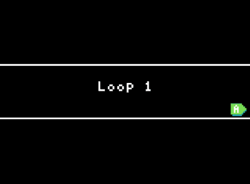

# Bucles



En blocs els bucles més comuns eren `repetir <x> veces` i `para <index> de 0 a <x>`. La principal diferència entre els dos es basava principalment en si l'usuari necessitava utilitzar l'índex en el seu bucle.

En Python utilitzarem el bucle `for` per a la majoria de les nostres tasques. Veurem com utilitzar aquest bucle per a les tasques més comunes.

### Bucle `for`

El bucle `for` és un tipus de bucle que s'utilitza per repetir una seqüència de codi un nombre específic de vegades. Aquest bucle és útil quan saps exactament quantes vegades vols que s'executi el codi.

En Python, el bucle `for` té la següent estructura:

```python
for variable in range(inici, final, pas):
    codi_a_executar
```

Quan el codi s'executa, farà el següent:

1. **Inicialització** Crearà una variable `variable` i li assignarà el valor `inici`.
2. Executarà el `codi_a_executar`.
3. **Actualització**: Incrementarà la variable `variable` pel valor `pas`.
4. **Comprovació**: Comprovarà si la variable `variable` és menor que `final`. Si ho és, tornarà a executar el `codi_a_executar` i incrementarà la variable `variable` pel valor `pas`. Si no ho és, sortirà del bucle.

### Exemple #1: Mostrant cadenes

1. Repassa el següent codi:
   ```python
    for i in range(0, 5):
        game.splash("hola número " + str(i))
   ```
2. Quin és el valor de `i` en la primera iteració del bucle?. En cada iteració, com canvia el valor de `i`? Quan acaba el bucle?
3. Camina pel que farà el codi **a mà**. Consulta les pistes a continuació per a les dues primeres iteracions del bucle.

#### Pista:

{: .nota }

> **Inicialització:** `i` comença en 0.
>
> **Primera Iteració:** `i` és 0. 0 és menor que 5, així que el bucle continuarà. El codi registrarà “hola número 0” a la consola. `i` incrementarà en 1, així que ara `i` és 1.
>
> **Segona Iteració:** `i` és 1. 1 és menor que 5, així que el bucle continuarà. El codi registrarà “hola número 1” a la consola. `i` incrementarà en 1, així que ara `i` és 2.

### Tasca #1: Modificar el Bucle

1. Comença amb el codi de l'exemple **#1**
2. Modifica la inicialització perquè `i` comenci en **10**
3. Modifica el punt de finalització perquè el bucle acabi en **50**
4. Crea una hipòtesi sobre què dirà l'última línia de sortida
5. Executa el codi per comprovar la teva hipòtesi
6. **Repte:** Fes que en cada pas `i` s'incremente en **2** en cada iteració. Com ha canviat la sortida?

### Exemple #2: Suma

1. Repassa el següent codi:
   ```python
    output = 0
    for i in range(0, 15):
        output += i
    print(output)
   ```
2. Identifica la inicialització, el punt de finalització i l'increment o pas del bucle.
3. Camina pel que farà el codi **a mà**

### Tasca #2: Producte

1. Crea una variable (`producte`) que sigui un nombre. Assigna-li el valor **1**
2. Crea un bucle for amb la variable `i`. Fes que `i` comenci en **1**, incrementi en **1** a cada iteració i acabi quan `i` sigui **major que** 15
3. En el bucle, assigna a `producte` el valor `producte * i`
4. **Repte:** crea una altra variable, `sortida`, que sigui una cadena. Assigna-li el valor "" (cadena buida) abans del bucle.
5. En el bucle, després de canviar el valor de `producte`, assigna a `sortida` el valor `sortida + str(producte) + " "`

## Bucles que s'executen mentre una condició sigui certa

En alguns casos, voldràs que el teu bucle s'executi mentre una condició sigui certa; no un nombre específic de vegades.

Per a això, pots utilitzar un bucle `while`. Aquest bucle s'executarà mentre la condició sigui certa i si la condició no mai és falsa, el bucle s'executarà per sempre.

En Python, el bucle `while` té la següent estructura:

```python
while condició:
    codi_a_executar
```

Quan el codi s'executa, comprova a cada iteració si la condició és certa. Si ho és, executarà el `codi_a_executar`. Si no ho és, sortirà del bucle.

### Exemple #3: Moure un sprite

En blocs vam utilitzar, sobretot, el bucle `al actualitzar`. Aquest bucle s'executava cada vegada que la pantalla s'actualitzava. Veurem més endavant com implementar el mateix bucle en Python; de moment, però, veurem com utilitzar un bucle `while` i la funció `pause` per aconseguir el mateix resultat.

1. Repassa el següent codi:

   ```python
    nau = sprites.create(img("""
        . . . . 8 . . . .
        . . . 8 8 8 . . .
        . . . 8 1 8 . . .
        . . 2 8 1 8 2 . .
        . 2 2 8 8 8 2 2 .
        2 2 2 8 8 8 2 2 2
        . . . 5 . 5 . . .
    """),
        SpriteKind.player)

    x = 0
    while x < 160:
        x += 1
        nau.x = x
        pause(100)
   ```

2. Què fa el codi?
3. Camina pel que farà el codi **a mà**. Quina serà la posició final de la nau?

### Tasca #3: Moviment complex

1. Comença amb el codi de l'exemple #3
2. Modifica el codi perquè la nau es mogui cap a la dreta i després cap a l'esquerra
3. **Repte:** Modifica el codi perquè la nau es mogui cap a la dreta, després cap a l'esquerra i finalment cap a la dreta de nou
   [//]: # (4. **Repte 2**: Modifica el codi perquè el moviment esquerra-dreta no pari mai. Com ho pots fer?)

## Què hem après?

## Avaluació

Crea un document i:

- Respon a les següents preguntes:
  - Amb les teves pròpies paraules, descriu que passa a les següents parts d'un bucle `for`:
    - Inicialització
    - Comprovació
    - Actualització
  - En Arcade, crea un nou projecte i col·loca un bucle `repeat` i un bucle `for index` en el `on start`. Converteix el codi a JavaScript: què és diferent entre els dos bucles?
  - Què passaria si el punt de finalització d'un bucle `for` fos menor que el punt d'inici? Comprova la teva resposta amb un exemple.
- Resol els següents exercicis curts i pega el codi en el document:
  - Escriu un codi que utilitzi una estructura de bucle `for` bàsic per a imprimir la següent sortida:
    - 1 és el nombre actual
    - 2 és el nombre actual
    - 3 és el nombre actual
    - 4 és el nombre actual
    - 5 és el nombre actual
    - 6 és el nombre actual
  - Escriu un codi que utilitzi una estructura de bucle `for` bàsic per a imprimir la següent sortida:
    - 11
    - 12
    - 13
    - 14
    - 15
  - Fes un codi que utilitzi una estructura de bucle `for` bàsic per a imprimir les següents sortides
    - Bucle normal:
      - 1 és el nombre actual
      - 2 és el nombre actual
      - 3 és el nombre actual
      - 4 és el nombre actual
      - 5 és el nombre actual
      - 6 és el nombre actual
    - Començant en un nombre diferent
      - 11
      - 12
      - 13
      - 14
      - 15
  - Escriu un codi que utilitzi una estructura de bucle `while` perquè moga un `Sprite` cap a la dreta fins que arribi a la posició 160. Utilitza la funció `pause` per aconseguir-ho.

**Puja el document a l'aula virtual (tasca 2.2.2).**
