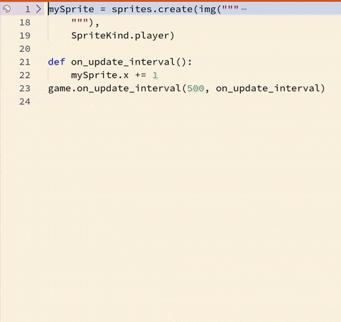

# Sprites


Els sprites s'utilitzen comunament per representar els personatges dels jocs en Arcade. Els personatges poden ser controlats per la persona que juga o per l'ordinador mateix.

## Concepte: Moviment simple de sprites

Crear i controlar `Sprites` són dos dels passos més importants en el desenvolupament del teu propi joc. El `Sprite` que controla un jugador proporciona una manera perquè el jugador interactuï amb el joc.

## Exemple #1: Sprites predefinits


1. Revisa el codi següent.
   ```python
   player = sprites.create(sprites.castle.princessFront0, 0)
   controller.moveSprite(player, 100, 100)
   ```
2. Identifica com es crea el `Sprite`.
3. Identifica com el jugador pot moure el `Sprite` en el joc.

En l'exemple anterior, l'`sprite` es crea utilitzant `sprites.create`. Hi ha molt a considerar:

- `player` és de tipus `Sprite`.
- La funció que crea el `Sprite` pren dues coses: una imatge (`sprites.castle.princessFront0` és una de les imatges proporcionades per començar) i un `kind` de 0.
- `controller.moveSprite` és una funció que pren un `Sprite` i permet que es mogui per la pantalla utilitzant les tecles de direcció. A més del `Sprite`, també necessita dos números: un per a la velocitat horitzontal i un altre per a la velocitat vertical.

### Tasca #1: Ralentitzar el nou sprite

1. Comença amb el codi de l'exemple **#1**
2. Canvia la imatge del `Sprite` de `princessFront0` a `princess2Front` (la part `sprites.castle.` ha de romandre davant)
3. Canvia el `vx` en `controller.moveSprite` a 50
4. Canvia el `sprites.vy` en `controller.moveSprite` a 150
5. Juga el joc i identifica com ha canviat en aquesta tasca

## Concepte: Personalitzar sprites

Quan crees el teu propi joc, probablement necessitaràs passar algun temps personalitzant els teus propis `sprites`. Això canviarà la manera com es veuen, així com la manera com es comporten.

Per començar a personalitzar els teus propis `sprites`, necessitarem aprendre sobre dues coses diferents: l'editor d'imatges i els `kinds` de sprites.

### Exemple #2a: El teu propi sprite

1. Revisa el codi següent

   ```python
   player = sprites.create("""
   . . . . . . b . b . . . . . . .
   . . . . . f b b b f f . . . . .
   . . . . f 1 b 7 b 1 c f . . . .
   . . . f 1 c c c c c 1 c f . . .
   . . . f c c f f f f c 1 f . . .
   . . . f c f f e e f f c f . . .
   . . f c f e f e e f e f c f . .
   . . f c f e a e e a e f c f . .
   . . f c c f e e e e f c c f . .
   . f c c f a f f f f a f c c f .
   . . f f e a b a a b a e f f . .
   . . f e e f a b b a f e e f . .
   . . . f f a a a a a a f f . . .
   . . . f a a b a a b a a f . . .
   . . . f f f f f f f f f f . . .
   . . . . . f f . . f f . . . . .
   """, SpriteKind.Player)

   controller.moveSprite(player, 100, 100)
   ```

2. Identifica les parts que són similars a l'exemple **#1** i les parts que són diferents

{: .nota }

> Una novetat en l'exemple anterior és l'ús de les cadenes de triple cometes (`"""`).
>
> Aquests strings poden ocupar múltiples línies i les utilitzarem per a les imatges dels `sprites`. Dins de la cadena, cada lletra representa un color diferent. Aquesta representació de la imatge permet que no calga pujar una imatge per a cada `sprite` que es vulgui crear.
>
> Per crear i modificar les imatges dels `sprites`, pots utilitzar l'editor d'imatges - fes clic a la paleta de colors a l'esquerra de la imatge per obrir-lo i dibuixar la teva obra mestra.
>
> 

### Exemple #2b: Afegir un nou `Kind`

1. Revisa el codi a continuació:

   ```python
   @namespace
   class SpriteKind:
       Quadrat = SpriteKind.create()

   quadrat = sprites.create(img("""
           1 1 1
           1 1 1
           1 1 1
       """),
       SpriteKind.Quadrat)

   controller.moveSprite(quadrat, 100, 100)
   ```

2. Compara el `SpriteKind` en aquest fragment amb el de l'exemple **#2a**. En que es diferencien?

{: .nota }

> El `SpriteKind` és una manera de classificar els `sprites` en grups. Això permet que el codi siga més llegible, fàcil de mantenir i possibilita que els `sprites` es comporten de manera diferent depenent del seu `kind` (per exemple podem fer que els `sprites` de tipus `Food` pujen vida al jugador, mentre que els `sprites` de tipus `Enemy` li resten vida).
>
> En aquest cas, el `SpriteKind` `Quadrat` es crea per a representar un quadrat. A continuació crearem nous tipus de `sprites` per a representar altres formes.

### Tasca #2: Afegir sprites

1. Comença amb el codi de l'exemple **#2b**
2. Afegeix **dos** nous `kind` a `SpriteKind`: `Cercle` i `Diamant`.
3. Crea **dos** nous sprites - un que sigui un `Cercle` i un altre que siga un `Diamant`. Utilitza l'editor d'imatges per dibuixar imatges per a aquests sprites.
4. **Repte:** afegeix un animal (per exemple, `Gos`) a l'enumeració `SpriteKind` i crea un `Sprite` per a aquest animal.

## Concepte: Propietats i funcions dels sprites

Els sprites tenen propietats i funcions que mantenen el seguiment dels diferents valors relacionats amb el sprite. Aquestes són les mateixes propietats que es van utilitzar en Blocs - `x`, `vx`, `left`, i així successivament.

Aquestes propietats i funcions es poden navegar fàcilment utilitzant la funció d'autocompletar.

### Exemple #3: Utilitzar una propietat

1. Revisa el codi següent

   ```python
   @namespace
   class SpriteKind:
       Quadrat = SpriteKind.create()

   jugador = sprites.create(img("""
       1 1 1
       1 1 1
       1 1 1
   """), SpriteKind.Quadrat)

   pausa(1000)
   jugador.x += 20
   ```

2. Identifica quina propietat de l'`sprite` es modifica
3. Observa l'ús de `pause` per fer que la modificació ocórrega després d'1 segon

## Tasca #3: Moviment repetitiu

1. Comença amb el codi de l'exemple **#3**
2. Utilitza un bucle `for` per fer que el `pause` i la modificació de la propietat ocórreguen **5 vegades**
3. En el bucle afegeix una altra línia per canviar la posició `y` del `player` per -10 en cada iteració
4. Abans del bucle, estableix la `vx` del `jugador` a -10

## Avaluació

Crea un document i:

- Respon a les següents preguntes:
  - Amb les teves pròpies paraules, explica per què dibuixar els teus propis `Sprites` pot ser important quan crees nous jocs.
  - Com permeten les propietats que interactues amb els `Sprites`?
- Resol els següents exercicis curts i pega el codi en el document:
  - Dibuixa un `Sprite` del teu animal favorit i crea un `Sprite` per a aquest animal.
  - Fes que el `Sprite` del teu animal favorit es pugui controlar amb les tecles de direcció.

**Puja el document a l'aula virtual (tasca 2.2.3).**
