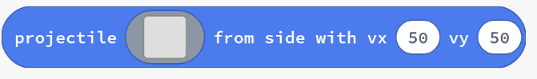
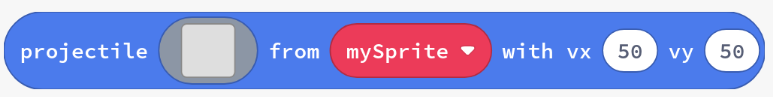

# Projectils

Els `sprites` formen la base de la majoria dels jocs en MakeCode Arcade. Hi ha diverses opcions disponibles per crear i utilitzar `sprites` per a fer-los flexibles i fàcils d'utilitzar.

Una de les opcions més importants és la capacitat de crear `projectils`. Aquests són `sprites` que es mouen per la pantalla de manera independent dels altres `sprites` i, per defecte, desapareixen quan arriben als límits de la pantalla.

Son útils per a representar objectes que es mouen per la pantalla, com ara bales, enemics, o qualsevol altre objecte que es mogui de manera independent del jugador.

## Concepte: Projectils en Python

En blocs, hi havia dues formes de crear`projectils`:

- `projectils des del costat`, que es mouen per la pantalla des del costat

  

  ```python
  # Passarem la imatge del projectil, la velocitat x i la velocitat y
  sprites.create_projectile_from_side(img: Image, vx: number, vy: number)
  ```

- i `projectil des d'sprite`, que comencen en la mateixa posició que l'`sprite` proporcionat.

  

  ```python
  # Passarem la imatge del projectil, l'sprite i la velocitat x i y
  sprites.create_projectile_from_sprite(img: Image, sprite: Sprite, vx: int, vy: int)
  ```

## Exemple #1: Taxi Veloç


1. Crea un nou projecte a Arcade.
2. Copia el següent codi a l'editor de MakeCode Arcade i executa'l.

   ```python
   taxi = sprites.create_projectile_from_side(sprites.vehicle.car_blue_right, 50, 0)

   for i in range(4):
       pause(1000)
       client = sprites.create_projectile_from_sprite(sprites.castle.princess_front0, taxi, 0, 30)
   ```

3. Identifica com s'utilitza `sprites.create_projectile_from_side` per crear un taxi que es mogui per la pantalla.
4. Identifica com s'utilitza `sprites.create_projectile_from_sprite` per crear clients que baixin del taxi.

## Tasca #1: Taxi amb molta feina

1. Comença amb el codi de l'exemple **#1**
2. Utilitza una segona vegada `create_projectile_from_sprite` en cada iteració del bucle, per crear un segon client que baixi del taxi i vaja en direcció contrària al primer client.
3. Fes que el `taxi` s'ature temporalment per fer que es baixen els clients:
   - Estableix la velocitat `vx` del taxi a 0
   - Pausa mig segon
4. Després que els clients baixen del taxi, restableix la seva `vx` a 50

{:.nota}

> Aquestes funcions no ens permeten definir el tipus de `SpriteKind` dels projectils creats. Per poder fer-ho tenim dues opcions:
>
> - Modificar el tipus de `SpriteKind` dels projectils després de ser creats utilitzant `my_sprite.set_kind(SpriteKind.<tipus>)`
>
> - Crear els projectils utilitzant `sprites.create_projectile` i definir el tipus de `SpriteKind` en el moment de la creació.
>
> - La primera opció és més senzilla, la segona és més flexible pero més complexa, per lo que no la veurem en aquesta activitat.

## Concepte: `Flags` d'Sprite

Les `flags` dels `sprites` poden utilitzar-se per a proporcionar comportaments comuns als `sprites`.


```python
projectil.set_flag(SpriteFlag.AUTO_DESTROY, False)
```

## Exemple #2: Pilota Rebotadora

1. Revisa el codi següent.

   ```python
   my_sprite = sprites.create(img("""
       . . . . d d d d d d d . . . .
       . . d d d d d d d d d d d . .
       . d d d d d d d d d d d d d .
       . d d d d d d d d d d d d d .
       d d d d d d d d d d d d d d d
       d d d d d d d d d d d d d d d
       d d d d d d d d d d d d d d d
       d d d d d d d d d d d d d d d
       d d d d d d d d d d d d d d d
       d d d d d d d d d d d d d d d
       d d d d d d d d d d d d d d d
       . d d d d d d d d d d d d d .
       . d d d d d d d d d d d d d .
       . . d d d d d d d d d d d . .
       . . . . d d d d d d d . . . .
   """))

   my_sprite.set_flag(SpriteFlag.BOUNCE_ON_WALL, True)

   # Per a les flags més utilitzades hi ha propietats específiques
   my_sprite.set_bounce_on_wall(True)

   my_sprite.vx = 50
   ```

2. Identifica com s'utilitza `set_bounce_on_wall` per fer que la pilota reboti contra les parets.

## Tasca #2: Més salts!

1. Comença amb el codi de l'exemple **#2**
2. Afegeix una acceleració en l'eix `y` (`ay`) de 40 a la pilota
3. Pausa durant 10 segons després d'establir l'acceleració
4. Després de la pausa, desactiva el rebot contra les parets (estableix-lo a `false`)
5. Què passa quan la pilota ja no rebota contra les parets?

## Concepte: Efectes de Partícules


Els efectes de partícules són efectes visuals que poden aplicar-se en el teu joc. Normalment no afecten la jugabilitat.

```python
sprite.start_effect(effects.fire)
effects.blizzard.start_screen_effect()
```

## Què hem aprés?

1. Com són diferents els `projectils` dels `sprites` creats amb `sprites.create`?
2. Com canvia el comportament d'un `Sprite` amb `SpriteFlag.StayInScreen`?
3. Com impacten els efectes de partícules al teu joc?
